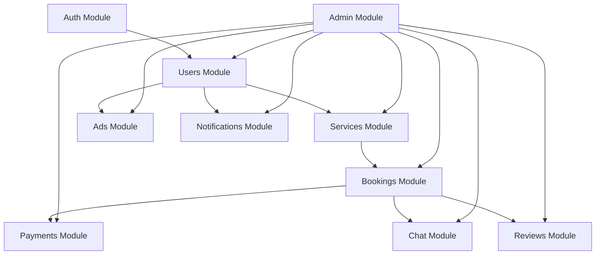
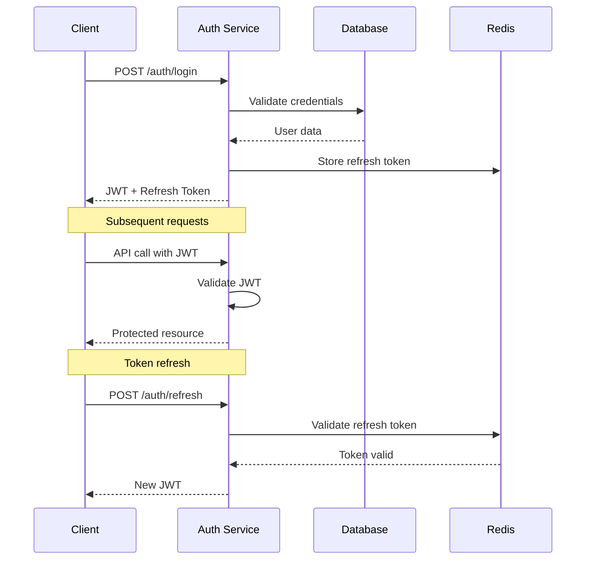
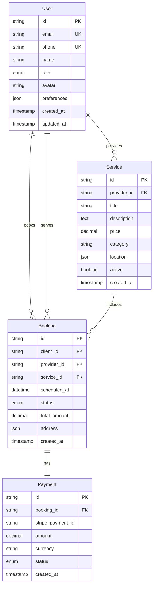
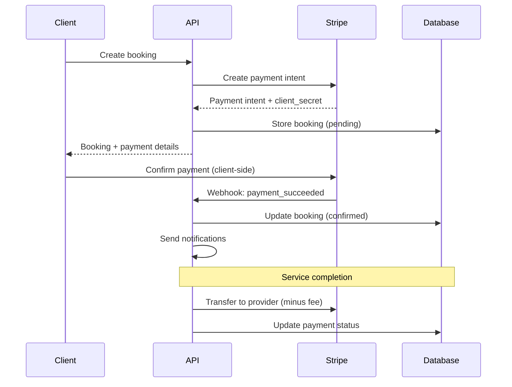
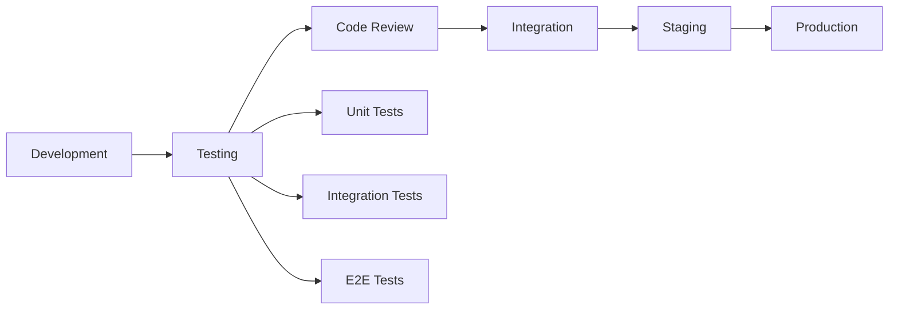

# 🏗️ System Architecture

This document describes the comprehensive architecture of the Fixelo platform, including its components, data flow, and design decisions.

## 📋 Overview

Fixelo is a modern services marketplace platform built with a microservices-oriented architecture, designed for scalability, maintainability, and performance. The platform serves three main user types: Clients (service seekers), Providers (service professionals), and Admins (platform moderators).

## 🎯 Architecture Principles

### Core Principles

1. **Scalability**: Horizontal and vertical scaling capabilities
2. **Modularity**: Loosely coupled, highly cohesive components
3. **Reliability**: Fault tolerance and graceful degradation
4. **Security**: Defense in depth with multiple security layers
5. **Performance**: Optimized for speed and efficiency
6. **Maintainability**: Clean code and clear separation of concerns

### Design Patterns

- **Repository Pattern**: Data access abstraction
- **Service Layer Pattern**: Business logic encapsulation
- **Observer Pattern**: Event-driven architecture
- **Strategy Pattern**: Payment and notification providers
- **Factory Pattern**: Service creation and configuration

## 🏛️ High-Level Architecture

```
┌─────────────────────────────────────────────────────────────────┐
│                        Client Layer                             │
├─────────────────┬─────────────────┬─────────────────┬───────────┤
│   Web App       │   Mobile App    │   Mobile PRO    │   Admin   │
│   (Next.js)     │   (React Native)│   (React Native)│ (AdminJS) │
└─────────────────┴─────────────────┴─────────────────┴───────────┘
                                │
                    ┌─────────────────────┐
                    │    API Gateway      │
                    │   (Load Balancer)   │
                    └─────────────────────┘
                                │
                    ┌─────────────────────┐
                    │    NestJS API       │
                    │   (Application)     │
                    └─────────────────────┘
                                │
        ┌───────────────────────┼───────────────────────┐
        │                       │                       │
┌─────────────┐        ┌─────────────┐        ┌─────────────┐
│ PostgreSQL  │        │    Redis    │        │  Supabase   │
│ (Database)  │        │   (Cache)   │        │  (Storage)  │
└─────────────┘        └─────────────┘        └─────────────┘
```

## 🔧 Technology Stack

### Backend
- **Framework**: NestJS (Node.js/TypeScript)
- **Database**: PostgreSQL with Prisma ORM
- **Cache**: Redis
- **Real-time**: Socket.IO
- **Authentication**: JWT + Refresh Tokens
- **File Storage**: Supabase Storage
- **Payments**: Stripe
- **Email**: Resend
- **SMS**: Twilio

### Frontend
- **Web**: Next.js 14 with TypeScript
- **Mobile**: React Native (Expo)
- **Styling**: TailwindCSS
- **UI Components**: shadcn/ui
- **State Management**: Zustand
- **Forms**: React Hook Form + Zod

### Infrastructure
- **Containerization**: Docker
- **Orchestration**: Docker Compose
- **Monitoring**: Sentry + PostHog
- **CI/CD**: GitHub Actions
- **Deployment**: Railway/Fly.io

## 🗂️ Module Architecture

### Core Modules

```
apps/api/src/modules/
├── auth/               # Authentication & Authorization
├── users/              # User Management
├── services/           # Service Catalog
├── bookings/           # Booking Management
├── payments/           # Payment Processing
├── chat/               # Real-time Messaging
├── ads/                # Advertisement System
├── reviews/            # Review & Rating System
├── notifications/      # Notification System
├── admin/              # Administrative Functions
└── health/             # Health Checks
```

### Module Dependencies



## 🔐 Authentication & Authorization

### Authentication Flow



### Authorization Levels

1. **Public**: Accessible without authentication
2. **Authenticated**: Requires valid JWT
3. **Role-based**: CLIENT, PROVIDER, ADMIN
4. **Resource-based**: Owner or admin access

### Security Features

- **JWT Tokens**: Short-lived access tokens (15 minutes)
- **Refresh Tokens**: Long-lived tokens (7 days)
- **Rate Limiting**: API endpoint protection
- **Input Validation**: Comprehensive data validation
- **CORS**: Cross-origin request security
- **Helmet**: Security headers

## 💾 Data Architecture

### Database Schema



### Data Access Patterns

1. **Repository Pattern**: Abstracted data access
2. **Query Optimization**: Efficient database queries
3. **Caching Strategy**: Redis for frequently accessed data
4. **Connection Pooling**: Optimized database connections

### Caching Strategy

```typescript
// Cache layers
interface CacheStrategy {
  L1: 'In-Memory Cache';    // Application-level
  L2: 'Redis Cache';        // Distributed cache
  L3: 'Database Cache';     // Query result cache
}

// Cache keys
const CACHE_KEYS = {
  SERVICES: 'services:*',
  USER_PROFILE: 'user:profile:*',
  BOOKING_DETAILS: 'booking:*',
  SEARCH_RESULTS: 'search:*'
};
```

## 🔄 API Architecture

### RESTful API Design

```
Base URL: https://api.fixelo.com/v1

Authentication:
POST   /auth/register
POST   /auth/login
POST   /auth/refresh
POST   /auth/logout

Users:
GET    /users/profile
PUT    /users/profile
POST   /users/upload-avatar
GET    /users/providers

Services:
GET    /services              # List services
POST   /services              # Create service (PROVIDER)
GET    /services/:id          # Get service details
PUT    /services/:id          # Update service (PROVIDER)
DELETE /services/:id          # Delete service (PROVIDER)
GET    /services/search       # Search services

Bookings:
GET    /bookings              # List user bookings
POST   /bookings              # Create booking
GET    /bookings/:id          # Get booking details
PUT    /bookings/:id          # Update booking
DELETE /bookings/:id          # Cancel booking

Payments:
POST   /payments/intent       # Create payment intent
POST   /payments/confirm      # Confirm payment
GET    /payments/history      # Payment history
POST   /payments/refund       # Process refund (ADMIN)

Chat:
GET    /chat/conversations    # List conversations
GET    /chat/messages/:id     # Get conversation messages
POST   /chat/messages         # Send message
```

### API Response Format

```typescript
interface ApiResponse<T> {
  success: boolean;
  data?: T;
  error?: {
    code: string;
    message: string;
    details?: any;
  };
  meta?: {
    page?: number;
    limit?: number;
    total?: number;
    hasNext?: boolean;
  };
}
```

### Error Handling

```typescript
enum ErrorCodes {
  VALIDATION_ERROR = 'VALIDATION_ERROR',
  UNAUTHORIZED = 'UNAUTHORIZED',
  FORBIDDEN = 'FORBIDDEN',
  NOT_FOUND = 'NOT_FOUND',
  CONFLICT = 'CONFLICT',
  INTERNAL_ERROR = 'INTERNAL_ERROR',
  SERVICE_UNAVAILABLE = 'SERVICE_UNAVAILABLE'
}
```

## 🔌 Real-time Architecture

### WebSocket Implementation

```typescript
// Socket.IO Events
interface SocketEvents {
  // Connection events
  'connect': void;
  'disconnect': void;
  
  // Chat events
  'join-conversation': { conversationId: string };
  'leave-conversation': { conversationId: string };
  'send-message': { conversationId: string; message: string };
  'message-received': { messageId: string; message: any };
  
  // Booking events
  'booking-update': { bookingId: string; status: string };
  'provider-location': { providerId: string; location: any };
  
  // Notification events
  'notification': { type: string; data: any };
}
```

### Real-time Features

1. **Chat System**: Instant messaging between clients and providers
2. **Booking Updates**: Real-time status changes
3. **Notifications**: Push notifications for important events
4. **Provider Tracking**: Live location updates during service

## 💳 Payment Architecture

### Payment Flow



### Payment Features

1. **Secure Processing**: PCI-compliant via Stripe
2. **Multiple Methods**: Cards, digital wallets, bank transfers
3. **Subscription Management**: PRO plan billing
4. **Fee Management**: 5% platform fee
5. **Refund Processing**: Automated refund system
6. **Payout Management**: Provider earnings distribution

## 📱 Mobile Architecture

### React Native Structure

```
apps/mobile/
├── src/
│   ├── components/        # Reusable UI components
│   ├── screens/           # Screen components
│   ├── navigation/        # Navigation configuration
│   ├── services/          # API and external services
│   ├── store/             # State management
│   ├── utils/             # Utility functions
│   └── types/             # TypeScript types
├── assets/                # Images, fonts, etc.
└── app.json              # Expo configuration
```

### State Management

```typescript
// Zustand store example
interface AppState {
  user: User | null;
  services: Service[];
  bookings: Booking[];
  
  // Actions
  setUser: (user: User) => void;
  loadServices: () => Promise<void>;
  createBooking: (booking: CreateBookingDto) => Promise<void>;
}
```

## 🔍 Search Architecture

### Search Implementation

```typescript
interface SearchParams {
  query?: string;
  category?: string;
  location?: {
    lat: number;
    lng: number;
    radius: number;
  };
  priceRange?: {
    min: number;
    max: number;
  };
  availability?: Date;
  rating?: number;
  sort?: 'price' | 'rating' | 'distance' | 'popularity';
}
```

### Search Features

1. **Full-text Search**: Service titles and descriptions
2. **Geolocation Search**: Distance-based filtering
3. **Category Filtering**: 120+ service categories
4. **Price Filtering**: Range-based price search
5. **Availability Search**: Real-time availability
6. **Rating Filter**: Minimum rating requirements

## 🔔 Notification Architecture

### Notification Types

```typescript
enum NotificationType {
  BOOKING_CREATED = 'booking_created',
  BOOKING_CONFIRMED = 'booking_confirmed',
  BOOKING_CANCELLED = 'booking_cancelled',
  PAYMENT_SUCCESSFUL = 'payment_successful',
  PAYMENT_FAILED = 'payment_failed',
  NEW_MESSAGE = 'new_message',
  SERVICE_REMINDER = 'service_reminder',
  REVIEW_REQUEST = 'review_request'
}
```

### Delivery Channels

1. **Push Notifications**: Mobile app notifications
2. **Email**: Important updates and confirmations
3. **SMS**: Critical booking updates
4. **In-app**: Real-time UI notifications

## 📊 Analytics Architecture

### Tracking Events

```typescript
interface AnalyticsEvent {
  event: string;
  properties: Record<string, any>;
  userId?: string;
  timestamp: Date;
}

// Example events
const EVENTS = {
  SERVICE_VIEWED: 'service_viewed',
  BOOKING_CREATED: 'booking_created',
  PAYMENT_COMPLETED: 'payment_completed',
  SEARCH_PERFORMED: 'search_performed',
  USER_REGISTERED: 'user_registered'
};
```

### Analytics Features

1. **User Behavior**: Page views, clicks, interactions
2. **Business Metrics**: Bookings, revenue, conversions
3. **Performance Metrics**: API response times, errors
4. **Custom Events**: Feature-specific tracking

## 🛡️ Security Architecture

### Security Layers

```
┌─────────────────────────────────────────┐
│              Application                │
├─────────────────────────────────────────┤
│            Authorization                │
├─────────────────────────────────────────┤
│            Authentication               │
├─────────────────────────────────────────┤
│            Input Validation             │
├─────────────────────────────────────────┤
│            Rate Limiting                │
├─────────────────────────────────────────┤
│            HTTPS/TLS                    │
└─────────────────────────────────────────┘
```

### Security Measures

1. **Data Encryption**: At rest and in transit
2. **Input Sanitization**: XSS and injection prevention
3. **Rate Limiting**: API abuse prevention
4. **CORS Configuration**: Cross-origin security
5. **Security Headers**: Helmet.js implementation
6. **Audit Logging**: Security event tracking

## 🚀 Performance Architecture

### Performance Optimization

1. **Database Indexing**: Optimized query performance
2. **Caching Strategy**: Multi-layer caching
3. **CDN Integration**: Static asset delivery
4. **Code Splitting**: Lazy loading
5. **Image Optimization**: Compressed and responsive images
6. **Connection Pooling**: Efficient database connections

### Performance Metrics

- **API Response Time**: < 200ms average
- **Database Query Time**: < 100ms average
- **Page Load Time**: < 3 seconds
- **Mobile App Launch**: < 2 seconds

## 🔧 Development Architecture

### Development Workflow



### Code Quality

1. **TypeScript**: Type safety
2. **ESLint**: Code linting
3. **Prettier**: Code formatting
4. **Husky**: Git hooks
5. **Conventional Commits**: Commit standards

## 🌐 Deployment Architecture

### Environment Structure

```
┌─────────────────┐    ┌─────────────────┐    ┌─────────────────┐
│   Development   │    │     Staging     │    │   Production    │
├─────────────────┤    ├─────────────────┤    ├─────────────────┤
│ Local Database  │    │ Staging Database│    │ Production DB   │
│ Mock Services   │    │ Test Services   │    │ Live Services   │
│ Debug Mode      │    │ Test Mode       │    │ Production Mode │
└─────────────────┘    └─────────────────┘    └─────────────────┘
```

### Deployment Strategy

1. **Blue-Green Deployment**: Zero-downtime deployments
2. **Health Checks**: Automated health monitoring
3. **Rollback Strategy**: Quick rollback capabilities
4. **Database Migrations**: Safe schema updates
5. **Environment Variables**: Secure configuration management

## 📈 Scalability Architecture

### Horizontal Scaling

```
┌─────────────────────────────────────────┐
│            Load Balancer                │
└─────────────────────────────────────────┘
                    │
    ┌───────────────┼───────────────┐
    │               │               │
┌─────────┐    ┌─────────┐    ┌─────────┐
│ API     │    │ API     │    │ API     │
│ Server  │    │ Server  │    │ Server  │
│ (1)     │    │ (2)     │    │ (3)     │
└─────────┘    └─────────┘    └─────────┘
```

### Scaling Strategies

1. **API Servers**: Multiple instances behind load balancer
2. **Database**: Read replicas for query optimization
3. **Cache**: Redis cluster for distributed caching
4. **File Storage**: CDN for static assets
5. **Background Jobs**: Queue-based processing

## 🔮 Future Architecture

### Planned Enhancements

1. **Microservices**: Gradual migration to microservices
2. **Event Sourcing**: Event-driven architecture
3. **GraphQL**: Flexible API queries
4. **Kubernetes**: Container orchestration
5. **AI/ML**: Recommendation engine
6. **Blockchain**: Decentralized reviews

### Technology Roadmap

```
Phase 1 (Current): Monolithic with modular design
Phase 2 (6 months): API Gateway + Service separation
Phase 3 (12 months): Full microservices architecture
Phase 4 (18 months): AI/ML integration
Phase 5 (24 months): Blockchain features
```

## 📚 Architecture Documentation

### Documentation Standards

1. **Architecture Decision Records (ADRs)**
2. **API Documentation**: OpenAPI/Swagger
3. **Database Schema**: ERD diagrams
4. **Sequence Diagrams**: Process flows
5. **Deployment Guides**: Environment setup

### Maintenance

- **Regular Reviews**: Monthly architecture reviews
- **Performance Monitoring**: Continuous monitoring
- **Security Audits**: Quarterly security assessments
- **Dependency Updates**: Regular updates and patches
- **Documentation Updates**: Keep docs current

---

This architecture is designed to support Fixelo's growth from a startup to a scalable platform serving thousands of users across Florida and beyond. The modular design allows for incremental improvements and technology adoption as the platform evolves.

For specific implementation details, refer to the individual module documentation in the `/docs/modules/` directory. 