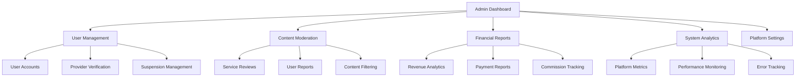

# 👨‍💼 Admin Panel Module

The Admin Panel module provides comprehensive administrative functionality for platform management, user oversight, content moderation, and system analytics.

## 📋 Overview

- **Status:** ❌ Pending
- **Location:** `apps/api/src/admin/`
- **Dependencies:** Prisma, Auth Module, All Business Modules
- **Database Tables:** AdminUser, AdminRole, AdminPermission, AdminLog

## 🏗️ Architecture

### Components

```
admin/
├── admin.controller.ts         # Admin endpoints
├── admin.service.ts            # Business logic
├── admin.module.ts             # Module configuration
├── dashboard/
│   ├── dashboard.service.ts    # Dashboard analytics
│   └── metrics.service.ts      # Metrics calculation
├── moderation/
│   ├── content.service.ts      # Content moderation
│   ├── user.service.ts         # User moderation
│   └── review.service.ts       # Review moderation
├── reports/
│   ├── analytics.service.ts    # Analytics reports
│   ├── financial.service.ts    # Financial reports
│   └── export.service.ts       # Data export
└── dto/
    ├── admin-filter.dto.ts     # Admin filtering
    ├── moderation.dto.ts       # Moderation actions
    └── report.dto.ts           # Report generation
```

### Admin Dashboard Architecture



## 🔑 Features

### User Management
- ✅ User account overview and search
- ✅ Provider verification and approval
- ✅ Account suspension and banning
- ✅ Role and permission management
- ✅ User activity monitoring
- ✅ Support ticket management

### Content Moderation
- ✅ Service listing moderation
- ✅ Review and rating moderation
- ✅ User-generated content filtering
- ✅ Spam detection and removal
- ✅ Inappropriate content flagging
- ✅ Automated moderation rules

### Financial Management
- ✅ Transaction monitoring
- ✅ Commission tracking
- ✅ Refund management
- ✅ Payment dispute resolution
- ✅ Revenue analytics
- ✅ Tax reporting

### System Analytics
- ✅ Platform usage statistics
- ✅ User engagement metrics
- ✅ Service performance analytics
- ✅ Geographic usage patterns
- ✅ Revenue and growth tracking
- ✅ Error and performance monitoring

### Platform Configuration
- ✅ System settings management
- ✅ Feature flag controls
- ✅ Commission rate settings
- ✅ Service category management
- ✅ Notification templates
- ✅ Email and SMS configurations

## 🛠️ API Endpoints

### Dashboard & Analytics

#### Get Dashboard Overview
```http
GET /admin/dashboard
Authorization: Bearer <admin_token>
```

**Response:**
```json
{
  "success": true,
  "dashboard": {
    "overview": {
      "totalUsers": 15420,
      "totalProviders": 3280,
      "totalServices": 12650,
      "totalBookings": 45230,
      "totalRevenue": 2456780.50,
      "platformCommission": 122839.03
    },
    "growth": {
      "usersGrowth": "+12.5%",
      "providersGrowth": "+8.3%",
      "revenueGrowth": "+15.7%",
      "bookingsGrowth": "+22.1%"
    },
    "recentActivity": [
      {
        "type": "user_registered",
        "count": 45,
        "timestamp": "2024-01-15T10:00:00Z"
      },
      {
        "type": "booking_completed",
        "count": 128,
        "timestamp": "2024-01-15T10:00:00Z"
      }
    ],
    "alerts": [
      {
        "type": "high_refund_rate",
        "message": "Refund rate increased by 15% in last 24h",
        "severity": "warning"
      }
    ]
  }
}
```

#### Get Platform Analytics
```http
GET /admin/analytics?period=month&metrics=users,revenue,bookings
Authorization: Bearer <admin_token>
```

**Response:**
```json
{
  "success": true,
  "analytics": {
    "period": "month",
    "startDate": "2024-01-01T00:00:00Z",
    "endDate": "2024-01-31T23:59:59Z",
    "metrics": {
      "users": {
        "total": 15420,
        "new": 1250,
        "active": 8340,
        "dailyBreakdown": [
          { "date": "2024-01-01", "value": 45 },
          { "date": "2024-01-02", "value": 52 }
        ]
      },
      "revenue": {
        "total": 245678.50,
        "commission": 12283.93,
        "averagePerBooking": 54.32,
        "topCategories": [
          { "category": "HOUSE_CLEANING", "revenue": 89234.50 },
          { "category": "HANDYMAN", "revenue": 67890.25 }
        ]
      },
      "bookings": {
        "total": 4523,
        "completed": 4102,
        "cancelled": 421,
        "completionRate": 90.7,
        "averageRating": 4.6
      }
    }
  }
}
```

### User Management

#### Get All Users
```http
GET /admin/users?page=1&limit=50&role=PROVIDER&status=active&search=john
Authorization: Bearer <admin_token>
```

**Response:**
```json
{
  "success": true,
  "users": [
    {
      "id": "user-uuid",
      "firstName": "John",
      "lastName": "Doe",
      "email": "john@example.com",
      "phone": "+1234567890",
      "role": "PROVIDER",
      "status": "active",
      "isVerified": true,
      "plan": "PRO",
      "joinedAt": "2024-01-15T10:00:00Z",
      "lastActiveAt": "2024-01-20T15:30:00Z",
      "stats": {
        "totalBookings": 156,
        "totalRevenue": 8450.00,
        "averageRating": 4.8,
        "completionRate": 95.5
      }
    }
  ],
  "pagination": {
    "page": 1,
    "limit": 50,
    "total": 3280,
    "pages": 66
  }
}
```

#### Get User Details
```http
GET /admin/users/:id
Authorization: Bearer <admin_token>
```

#### Verify Provider
```http
PUT /admin/users/:id/verify
Authorization: Bearer <admin_token>
Content-Type: application/json

{
  "verified": true,
  "verificationNotes": "All documents verified successfully",
  "badgeType": "verified_pro"
}
```

#### Suspend User
```http
PUT /admin/users/:id/suspend
Authorization: Bearer <admin_token>
Content-Type: application/json

{
  "suspended": true,
  "reason": "Multiple policy violations",
  "duration": "30 days",
  "notifyUser": true
}
```

#### Ban User
```http
PUT /admin/users/:id/ban
Authorization: Bearer <admin_token>
Content-Type: application/json

{
  "banned": true,
  "reason": "Fraudulent activity",
  "permanent": true,
  "refundPendingBookings": true
}
```

### Content Moderation

#### Get Pending Reviews
```http
GET /admin/moderation/reviews?status=pending&page=1&limit=20
Authorization: Bearer <admin_token>
```

**Response:**
```json
{
  "success": true,
  "reviews": [
    {
      "id": "review-uuid",
      "service": {
        "title": "House Cleaning Service",
        "provider": "Smith Cleaning"
      },
      "client": {
        "name": "John D.",
        "isVerified": true
      },
      "rating": 1,
      "comment": "Terrible service, never showed up!",
      "flaggedReasons": ["inappropriate_language", "false_claim"],
      "reportCount": 3,
      "createdAt": "2024-01-15T10:00:00Z"
    }
  ]
}
```

#### Moderate Review
```http
PUT /admin/moderation/reviews/:id
Authorization: Bearer <admin_token>
Content-Type: application/json

{
  "action": "approve",
  "reason": "Review meets community guidelines",
  "notifyUser": false
}
```

#### Get Reported Content
```http
GET /admin/moderation/reports?type=service&status=pending
Authorization: Bearer <admin_token>
```

#### Moderate Service Listing
```http
PUT /admin/moderation/services/:id
Authorization: Bearer <admin_token>
Content-Type: application/json

{
  "action": "reject",
  "reason": "Inappropriate content in description",
  "feedback": "Please remove promotional language and focus on service details"
}
```

### Financial Management

#### Get Financial Overview
```http
GET /admin/financial/overview?period=month
Authorization: Bearer <admin_token>
```

**Response:**
```json
{
  "success": true,
  "financial": {
    "totalRevenue": 245678.50,
    "platformCommission": 12283.93,
    "providerEarnings": 233394.57,
    "totalTransactions": 4523,
    "averageTransactionValue": 54.32,
    "refunds": {
      "total": 2340.50,
      "count": 23,
      "rate": 0.95
    },
    "disputes": {
      "open": 5,
      "resolved": 18,
      "total": 23
    },
    "topProviders": [
      {
        "id": "provider-uuid",
        "name": "Smith Cleaning Services",
        "revenue": 12450.00,
        "bookings": 156
      }
    ]
  }
}
```

#### Get Transaction Details
```http
GET /admin/financial/transactions?page=1&limit=50&status=completed&type=booking
Authorization: Bearer <admin_token>
```

#### Process Refund
```http
POST /admin/financial/refunds
Authorization: Bearer <admin_token>
Content-Type: application/json

{
  "transactionId": "txn-uuid",
  "amount": 80.00,
  "reason": "Service not provided",
  "notifyUser": true,
  "adminNotes": "Customer complaint verified"
}
```

### System Configuration

#### Get Platform Settings
```http
GET /admin/settings
Authorization: Bearer <admin_token>
```

**Response:**
```json
{
  "success": true,
  "settings": {
    "platform": {
      "commissionRate": 5.0,
      "minimumBookingAmount": 25.00,
      "maxBookingAmount": 2000.00,
      "autoApprovalEnabled": true,
      "maintenanceMode": false
    },
    "features": {
      "chatEnabled": true,
      "reviewsEnabled": true,
      "adsEnabled": true,
      "subscriptionsEnabled": true
    },
    "moderation": {
      "autoModerationEnabled": true,
      "profanityFilterEnabled": true,
      "spamDetectionEnabled": true,
      "reviewModerationThreshold": 3
    },
    "notifications": {
      "emailEnabled": true,
      "smsEnabled": true,
      "pushEnabled": true,
      "marketingEnabled": true
    }
  }
}
```

#### Update Platform Settings
```http
PUT /admin/settings
Authorization: Bearer <admin_token>
Content-Type: application/json

{
  "platform": {
    "commissionRate": 4.5,
    "autoApprovalEnabled": false
  },
  "features": {
    "chatEnabled": true,
    "adsEnabled": false
  }
}
```

### Reports & Export

#### Generate Report
```http
POST /admin/reports/generate
Authorization: Bearer <admin_token>
Content-Type: application/json

{
  "type": "user_activity",
  "period": "month",
  "startDate": "2024-01-01",
  "endDate": "2024-01-31",
  "format": "csv",
  "filters": {
    "userRole": "PROVIDER",
    "includeInactive": false
  }
}
```

#### Export Data
```http
GET /admin/export/users?format=csv&filters=active
Authorization: Bearer <admin_token>
```

#### Get System Logs
```http
GET /admin/logs?level=error&page=1&limit=100&date=2024-01-15
Authorization: Bearer <admin_token>
```

## 📊 Database Schema

### AdminUser Table
```sql
CREATE TABLE "AdminUser" (
    "id" TEXT NOT NULL,
    "userId" TEXT NOT NULL,
    "roleId" TEXT NOT NULL,
    "permissions" TEXT[],
    "isActive" BOOLEAN NOT NULL DEFAULT true,
    "lastLoginAt" TIMESTAMP(3),
    "createdBy" TEXT NOT NULL,
    "createdAt" TIMESTAMP(3) NOT NULL DEFAULT CURRENT_TIMESTAMP,
    "updatedAt" TIMESTAMP(3) NOT NULL,
    
    CONSTRAINT "AdminUser_pkey" PRIMARY KEY ("id")
);
```

### AdminRole Table
```sql
CREATE TABLE "AdminRole" (
    "id" TEXT NOT NULL,
    "name" TEXT NOT NULL,
    "description" TEXT,
    "permissions" TEXT[],
    "level" INTEGER NOT NULL DEFAULT 1,
    "isActive" BOOLEAN NOT NULL DEFAULT true,
    "createdAt" TIMESTAMP(3) NOT NULL DEFAULT CURRENT_TIMESTAMP,
    "updatedAt" TIMESTAMP(3) NOT NULL,
    
    CONSTRAINT "AdminRole_pkey" PRIMARY KEY ("id")
);
```

### AdminLog Table
```sql
CREATE TABLE "AdminLog" (
    "id" TEXT NOT NULL,
    "adminId" TEXT NOT NULL,
    "action" TEXT NOT NULL,
    "target" TEXT,
    "targetId" TEXT,
    "details" JSONB,
    "ipAddress" TEXT,
    "userAgent" TEXT,
    "createdAt" TIMESTAMP(3) NOT NULL DEFAULT CURRENT_TIMESTAMP,
    
    CONSTRAINT "AdminLog_pkey" PRIMARY KEY ("id")
);
```

### ModerationAction Table
```sql
CREATE TABLE "ModerationAction" (
    "id" TEXT NOT NULL,
    "moderatorId" TEXT NOT NULL,
    "targetType" "ModerationTargetType" NOT NULL,
    "targetId" TEXT NOT NULL,
    "action" "ModerationActionType" NOT NULL,
    "reason" TEXT,
    "details" TEXT,
    "automated" BOOLEAN NOT NULL DEFAULT false,
    "createdAt" TIMESTAMP(3) NOT NULL DEFAULT CURRENT_TIMESTAMP,
    
    CONSTRAINT "ModerationAction_pkey" PRIMARY KEY ("id")
);
```

### Admin Enums
```typescript
export enum AdminPermission {
  USER_MANAGEMENT = 'user_management',
  CONTENT_MODERATION = 'content_moderation',
  FINANCIAL_MANAGEMENT = 'financial_management',
  SYSTEM_CONFIGURATION = 'system_configuration',
  ANALYTICS_ACCESS = 'analytics_access',
  SUPER_ADMIN = 'super_admin'
}

export enum ModerationTargetType {
  USER = 'user',
  SERVICE = 'service',
  REVIEW = 'review',
  BOOKING = 'booking',
  MESSAGE = 'message'
}

export enum ModerationActionType {
  APPROVE = 'approve',
  REJECT = 'reject',
  SUSPEND = 'suspend',
  BAN = 'ban',
  HIDE = 'hide',
  WARN = 'warn'
}
```

## 🎯 Usage Examples

### Admin Dashboard Component

```typescript
// React admin dashboard
import { useQuery } from '@tanstack/react-query';
import { getDashboardData, getAnalytics } from '../api/admin';

function AdminDashboard() {
  const { data: dashboard, isLoading } = useQuery({
    queryKey: ['admin-dashboard'],
    queryFn: getDashboardData,
    refetchInterval: 30000 // Refresh every 30 seconds
  });

  const { data: analytics } = useQuery({
    queryKey: ['admin-analytics', 'month'],
    queryFn: () => getAnalytics({ period: 'month' })
  });

  return (
    <div className="admin-dashboard">
      <div className="dashboard-header">
        <h1>Admin Dashboard</h1>
        <div className="quick-actions">
          <button onClick={() => navigate('/admin/users')}>
            Manage Users
          </button>
          <button onClick={() => navigate('/admin/moderation')}>
            Content Moderation
          </button>
          <button onClick={() => navigate('/admin/financial')}>
            Financial Reports
          </button>
        </div>
      </div>

      <div className="overview-cards">
        <StatCard
          title="Total Users"
          value={dashboard?.overview.totalUsers}
          growth={dashboard?.growth.usersGrowth}
          icon="👥"
        />
        <StatCard
          title="Total Revenue"
          value={`$${dashboard?.overview.totalRevenue}`}
          growth={dashboard?.growth.revenueGrowth}
          icon="💰"
        />
        <StatCard
          title="Active Bookings"
          value={dashboard?.overview.totalBookings}
          growth={dashboard?.growth.bookingsGrowth}
          icon="📅"
        />
        <StatCard
          title="Platform Commission"
          value={`$${dashboard?.overview.platformCommission}`}
          icon="🏦"
        />
      </div>

      <div className="dashboard-content">
        <div className="analytics-section">
          <h2>Platform Analytics</h2>
          <AnalyticsChart data={analytics?.metrics} />
        </div>

        <div className="recent-activity">
          <h2>Recent Activity</h2>
          <ActivityFeed activities={dashboard?.recentActivity} />
        </div>

        <div className="alerts-section">
          <h2>System Alerts</h2>
          <AlertsList alerts={dashboard?.alerts} />
        </div>
      </div>
    </div>
  );
}
```

### User Management Interface

```typescript
// User management component
function UserManagement() {
  const [filters, setFilters] = useState({
    role: '',
    status: '',
    search: ''
  });

  const { data: users, isLoading } = useQuery({
    queryKey: ['admin-users', filters],
    queryFn: () => getUsers(filters)
  });

  const verifyUserMutation = useMutation({
    mutationFn: verifyUser,
    onSuccess: () => {
      queryClient.invalidateQueries(['admin-users']);
      toast.success('User verified successfully');
    }
  });

  const suspendUserMutation = useMutation({
    mutationFn: suspendUser,
    onSuccess: () => {
      queryClient.invalidateQueries(['admin-users']);
      toast.success('User suspended successfully');
    }
  });

  return (
    <div className="user-management">
      <div className="filters">
        <input
          type="text"
          placeholder="Search users..."
          value={filters.search}
          onChange={(e) => setFilters({...filters, search: e.target.value})}
        />
        <select
          value={filters.role}
          onChange={(e) => setFilters({...filters, role: e.target.value})}
        >
          <option value="">All Roles</option>
          <option value="CLIENT">Clients</option>
          <option value="PROVIDER">Providers</option>
        </select>
        <select
          value={filters.status}
          onChange={(e) => setFilters({...filters, status: e.target.value})}
        >
          <option value="">All Status</option>
          <option value="active">Active</option>
          <option value="suspended">Suspended</option>
          <option value="banned">Banned</option>
        </select>
      </div>

      <div className="users-table">
        <table>
          <thead>
            <tr>
              <th>User</th>
              <th>Role</th>
              <th>Status</th>
              <th>Joined</th>
              <th>Stats</th>
              <th>Actions</th>
            </tr>
          </thead>
          <tbody>
            {users?.users.map(user => (
              <tr key={user.id}>
                <td>
                  <div className="user-info">
                    
                    <div>
                      <strong>{user.firstName} {user.lastName}</strong>
                      <p>{user.email}</p>
                    </div>
                  </div>
                </td>
                <td>
                  <span className={`role-badge ${user.role.toLowerCase()}`}>
                    {user.role}
                  </span>
                </td>
                <td>
                  <span className={`status-badge ${user.status}`}>
                    {user.status}
                  </span>
                </td>
                <td>{formatDate(user.joinedAt)}</td>
                <td>
                  {user.role === 'PROVIDER' && (
                    <div className="provider-stats">
                      <p>Bookings: {user.stats.totalBookings}</p>
                      <p>Rating: {user.stats.averageRating}⭐</p>
                      <p>Revenue: ${user.stats.totalRevenue}</p>
                    </div>
                  )}
                </td>
                <td>
                  <div className="user-actions">
                    <button onClick={() => navigate(`/admin/users/${user.id}`)}>
                      View
                    </button>
                    {!user.isVerified && user.role === 'PROVIDER' && (
                      <button 
                        onClick={() => verifyUserMutation.mutate(user.id)}
                        className="verify-btn"
                      >
                        Verify
                      </button>
                    )}
                    {user.status === 'active' && (
                      <button 
                        onClick={() => suspendUserMutation.mutate({
                          userId: user.id,
                          reason: 'Manual suspension',
                          duration: '30 days'
                        })}
                        className="suspend-btn"
                      >
                        Suspend
                      </button>
                    )}
                  </div>
                </td>
              </tr>
            ))}
          </tbody>
        </table>
      </div>
    </div>
  );
}
```

### Content Moderation Interface

```typescript
// Content moderation component
function ContentModeration() {
  const [activeTab, setActiveTab] = useState('reviews');

  const { data: pendingReviews } = useQuery({
    queryKey: ['admin-pending-reviews'],
    queryFn: () => getPendingReviews()
  });

  const { data: reportedContent } = useQuery({
    queryKey: ['admin-reported-content'],
    queryFn: () => getReportedContent()
  });

  const moderateReviewMutation = useMutation({
    mutationFn: moderateReview,
    onSuccess: () => {
      queryClient.invalidateQueries(['admin-pending-reviews']);
      toast.success('Review moderated successfully');
    }
  });

  return (
    <div className="content-moderation">
      <div className="moderation-tabs">
        <button 
          className={activeTab === 'reviews' ? 'active' : ''}
          onClick={() => setActiveTab('reviews')}
        >
          Pending Reviews ({pendingReviews?.length || 0})
        </button>
        <button 
          className={activeTab === 'reports' ? 'active' : ''}
          onClick={() => setActiveTab('reports')}
        >
          Reported Content ({reportedContent?.length || 0})
        </button>
        <button 
          className={activeTab === 'services' ? 'active' : ''}
          onClick={() => setActiveTab('services')}
        >
          Service Listings
        </button>
      </div>

      {activeTab === 'reviews' && (
        <div className="reviews-moderation">
          {pendingReviews?.map(review => (
            <div key={review.id} className="review-card">
              <div className="review-header">
                <h4>{review.service.title}</h4>
                <span className="rating">{'⭐'.repeat(review.rating)}</span>
              </div>
              
              <div className="review-content">
                <p>{review.comment}</p>
                {review.flaggedReasons.length > 0 && (
                  <div className="flagged-reasons">
                    <strong>Flagged for:</strong>
                    {review.flaggedReasons.map(reason => (
                      <span key={reason} className="flag-badge">{reason}</span>
                    ))}
                  </div>
                )}
              </div>

              <div className="review-actions">
                <button 
                  onClick={() => moderateReviewMutation.mutate({
                    reviewId: review.id,
                    action: 'approve',
                    reason: 'Review meets guidelines'
                  })}
                  className="approve-btn"
                >
                  Approve
                </button>
                <button 
                  onClick={() => moderateReviewMutation.mutate({
                    reviewId: review.id,
                    action: 'reject',
                    reason: 'Violates community guidelines'
                  })}
                  className="reject-btn"
                >
                  Reject
                </button>
                <button className="details-btn">
                  View Details
                </button>
              </div>
            </div>
          ))}
        </div>
      )}
    </div>
  );
}
```

## 🔒 Security & Permissions

### Role-Based Access Control
- Super Admin: Full system access
- Admin: User and content management
- Moderator: Content moderation only
- Support: User support and basic analytics

### Audit Logging
- All admin actions logged
- IP address and user agent tracking
- Detailed action history
- Compliance reporting

### Security Features
- Multi-factor authentication
- Session management
- IP whitelisting
- Rate limiting

## 🧪 Testing

### Unit Tests
```typescript
describe('AdminService', () => {
  it('should verify provider account', async () => {
    const result = await service.verifyProvider('provider-123', {
      verified: true,
      badgeType: 'verified_pro'
    });
    
    expect(result.isVerified).toBe(true);
    expect(result.badgeType).toBe('verified_pro');
  });

  it('should generate financial report', async () => {
    const report = await service.generateFinancialReport({
      period: 'month',
      startDate: '2024-01-01',
      endDate: '2024-01-31'
    });
    
    expect(report.totalRevenue).toBeGreaterThan(0);
    expect(report.transactions).toBeDefined();
  });
});
```

### Integration Tests
```typescript
describe('Admin API', () => {
  it('should moderate review with admin permissions', async () => {
    const response = await request(app.getHttpServer())
      .put('/admin/moderation/reviews/review-123')
      .set('Authorization', `Bearer ${adminToken}`)
      .send({ action: 'approve' })
      .expect(200);

    expect(response.body.success).toBe(true);
  });
});
```

## 🔧 Configuration

### Environment Variables
```env
# Admin Configuration
ADMIN_SESSION_DURATION=8h
ADMIN_MFA_REQUIRED=true
ADMIN_IP_WHITELIST=192.168.1.0/24,10.0.0.0/8

# Rate Limiting
ADMIN_RATE_LIMIT=1000  # per hour
ADMIN_BULK_OPERATION_LIMIT=100  # per request

# Audit Logging
ADMIN_LOG_RETENTION_DAYS=365
ADMIN_LOG_LEVEL=info

# Notifications
ADMIN_ALERT_EMAIL=admin@fixelo.com
ADMIN_WEBHOOK_URL=https://hooks.slack.com/...
```

### Default Admin Roles
```typescript
const DEFAULT_ADMIN_ROLES = [
  {
    name: 'Super Admin',
    permissions: ['*'],
    level: 5
  },
  {
    name: 'Admin',
    permissions: [
      'user_management',
      'content_moderation',
      'financial_management',
      'analytics_access'
    ],
    level: 4
  },
  {
    name: 'Moderator',
    permissions: ['content_moderation'],
    level: 2
  },
  {
    name: 'Support',
    permissions: ['user_management', 'analytics_access'],
    level: 1
  }
];
```

## 📚 Related Documentation

- [User Management](./users.md)
- [Content Moderation Guide](../guides/content-moderation.md)
- [Financial Management](./payments.md)
- [Analytics & Reporting](../guides/analytics.md)

## 🐛 Troubleshooting

### Common Issues

1. **Permission Denied Errors**
   - Verify admin role assignments
   - Check permission configurations
   - Review access logs

2. **Dashboard Loading Issues**
   - Check database connections
   - Verify analytics data availability
   - Review API rate limits

3. **Export/Report Generation Fails**
   - Check data volume limits
   - Verify file permissions
   - Review memory usage

### Debug Commands
```bash
# Check admin permissions
npm run admin:check-permissions

# Generate test reports
npm run admin:test-reports

# View admin logs
npm run logs:admin
``` 