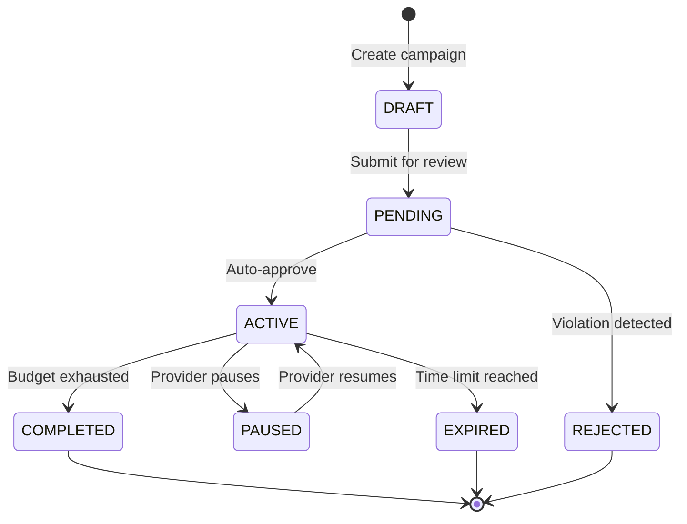

# 🚀 ADS System Module

The ADS System module manages service promotion campaigns, allowing PRO providers to boost their services for increased visibility and lead generation.

## 📋 Overview

- **Status:** ✅ Complete
- **Location:** `apps/api/src/ads/` (integrated with services)
- **Dependencies:** Prisma, Auth Module, Services Module, Payments Module
- **Database Tables:** AdCampaign, AdBid, AdPerformance

## 🏗️ Architecture

### Components

```
ads/
├── ads.controller.ts       # ADS campaign endpoints
├── ads.service.ts          # Business logic
├── ads.module.ts           # Module configuration
├── bidding.service.ts      # Bidding algorithm
└── dto/
    ├── create-campaign.dto.ts    # Campaign creation
    ├── update-campaign.dto.ts    # Campaign updates
    ├── bid-management.dto.ts     # Bidding management
    └── performance.dto.ts        # Performance tracking
```

### Campaign Lifecycle



## 🔑 Features

### Campaign Management
- ✅ Create and manage promotion campaigns
- ✅ Service boost with budget allocation
- ✅ Duration-based campaigns (1-30 days)
- ✅ Budget control and spending limits
- ✅ Campaign pause/resume functionality
- ✅ Automatic campaign expiration

### Bidding System
- ✅ Real-time bidding for search positions
- ✅ Cost-per-click (CPC) model
- ✅ Automatic bid optimization
- ✅ Bid adjustment based on performance
- ✅ Competitive bidding algorithm
- ✅ Budget distribution optimization

### Performance Tracking
- ✅ Impression tracking
- ✅ Click-through rate (CTR) monitoring
- ✅ Conversion tracking
- ✅ Cost per acquisition (CPA) analysis
- ✅ ROI calculation
- ✅ Real-time performance dashboard

### Targeting Options
- ✅ Geographic targeting (city/radius)
- ✅ Service category targeting
- ✅ Time-based scheduling
- ✅ Device targeting (mobile/desktop)
- ✅ Audience demographic targeting
- ✅ Competitor targeting

## 🛠️ API Endpoints

### Campaign Management

#### Create Campaign
```http
POST /ads/campaigns
Authorization: Bearer <access_token>
Content-Type: application/json

{
  "serviceId": "service-uuid",
  "name": "House Cleaning Boost",
  "budget": 100.00,
  "duration": 7,
  "bidAmount": 2.50,
  "targeting": {
    "cities": ["Miami", "Fort Lauderdale"],
    "radius": 25,
    "demographics": {
      "ageRange": [25, 65],
      "interests": ["home_improvement", "cleaning"]
    }
  },
  "schedule": {
    "startDate": "2024-02-15T00:00:00Z",
    "endDate": "2024-02-22T23:59:59Z",
    "timeSlots": [
      {
        "day": "monday",
        "startTime": "09:00",
        "endTime": "17:00"
      }
    ]
  }
}
```

**Response:**
```json
{
  "success": true,
  "campaign": {
    "id": "campaign-uuid",
    "serviceId": "service-uuid",
    "name": "House Cleaning Boost",
    "status": "PENDING",
    "budget": 100.00,
    "spent": 0.00,
    "remaining": 100.00,
    "duration": 7,
    "bidAmount": 2.50,
    "estimatedReach": 1250,
    "estimatedClicks": 45,
    "createdAt": "2024-02-15T10:00:00Z",
    "startDate": "2024-02-15T00:00:00Z",
    "endDate": "2024-02-22T23:59:59Z"
  }
}
```

#### Get Campaign Performance
```http
GET /ads/campaigns/:id/performance
Authorization: Bearer <access_token>
```

**Response:**
```json
{
  "success": true,
  "performance": {
    "campaignId": "campaign-uuid",
    "impressions": 2845,
    "clicks": 127,
    "ctr": 4.47,
    "conversions": 18,
    "conversionRate": 14.17,
    "spent": 78.50,
    "remaining": 21.50,
    "avgCpc": 0.62,
    "cpa": 4.36,
    "roi": 2.34,
    "dailyStats": [
      {
        "date": "2024-02-15",
        "impressions": 412,
        "clicks": 18,
        "spent": 11.25,
        "conversions": 3
      }
    ]
  }
}
```

#### Update Campaign
```http
PUT /ads/campaigns/:id
Authorization: Bearer <access_token>
Content-Type: application/json

{
  "budget": 150.00,
  "bidAmount": 3.00,
  "status": "ACTIVE"
}
```

#### Pause/Resume Campaign
```http
PUT /ads/campaigns/:id/status
Authorization: Bearer <access_token>
Content-Type: application/json

{
  "status": "PAUSED"
}
```

### Bidding Management

#### Get Current Bid Position
```http
GET /ads/bidding/position/:serviceId?location=Miami&category=HOUSE_CLEANING
Authorization: Bearer <access_token>
```

**Response:**
```json
{
  "success": true,
  "bidPosition": {
    "currentPosition": 3,
    "currentBid": 2.50,
    "topBid": 3.75,
    "averageBid": 2.85,
    "recommendedBid": 3.00,
    "estimatedPosition": 2,
    "competitors": [
      {
        "position": 1,
        "bidRange": "3.50-4.00",
        "businessName": "Anonymous Competitor"
      }
    ]
  }
}
```

#### Update Bid Amount
```http
PUT /ads/bidding/campaigns/:id/bid
Authorization: Bearer <access_token>
Content-Type: application/json

{
  "bidAmount": 3.25,
  "autoOptimize": true
}
```

### Analytics & Reporting

#### Get Campaign Analytics
```http
GET /ads/analytics/campaigns/:id?period=week&metrics=impressions,clicks,conversions
Authorization: Bearer <access_token>
```

#### Get ADS Dashboard
```http
GET /ads/dashboard
Authorization: Bearer <access_token>
```

**Response:**
```json
{
  "success": true,
  "dashboard": {
    "totalCampaigns": 5,
    "activeCampaigns": 3,
    "totalSpent": 456.78,
    "totalImpressions": 12450,
    "totalClicks": 567,
    "totalConversions": 89,
    "averageCtr": 4.55,
    "averageCpa": 5.13,
    "topPerformingCampaigns": [
      {
        "id": "campaign-1",
        "name": "House Cleaning Boost",
        "roi": 3.45,
        "conversions": 23
      }
    ]
  }
}
```

### Budget Management

#### Add Budget to Campaign
```http
POST /ads/campaigns/:id/budget
Authorization: Bearer <access_token>
Content-Type: application/json

{
  "amount": 50.00,
  "paymentMethodId": "pm_1234567890"
}
```

#### Get Budget History
```http
GET /ads/campaigns/:id/budget/history
Authorization: Bearer <access_token>
```

## 📊 Database Schema

### AdCampaign Table
```sql
CREATE TABLE "AdCampaign" (
    "id" TEXT NOT NULL,
    "serviceId" TEXT NOT NULL,
    "providerId" TEXT NOT NULL,
    "name" TEXT NOT NULL,
    "status" "CampaignStatus" NOT NULL DEFAULT 'DRAFT',
    "budget" DECIMAL(10,2) NOT NULL,
    "spent" DECIMAL(10,2) NOT NULL DEFAULT 0,
    "bidAmount" DECIMAL(10,2) NOT NULL,
    "duration" INTEGER NOT NULL,
    "targeting" JSONB NOT NULL,
    "schedule" JSONB,
    "startDate" TIMESTAMP(3) NOT NULL,
    "endDate" TIMESTAMP(3) NOT NULL,
    "createdAt" TIMESTAMP(3) NOT NULL DEFAULT CURRENT_TIMESTAMP,
    "updatedAt" TIMESTAMP(3) NOT NULL,
    
    CONSTRAINT "AdCampaign_pkey" PRIMARY KEY ("id")
);
```

### AdBid Table
```sql
CREATE TABLE "AdBid" (
    "id" TEXT NOT NULL,
    "campaignId" TEXT NOT NULL,
    "serviceId" TEXT NOT NULL,
    "bidAmount" DECIMAL(10,2) NOT NULL,
    "position" INTEGER NOT NULL,
    "location" TEXT NOT NULL,
    "category" TEXT NOT NULL,
    "isActive" BOOLEAN NOT NULL DEFAULT true,
    "createdAt" TIMESTAMP(3) NOT NULL DEFAULT CURRENT_TIMESTAMP,
    "updatedAt" TIMESTAMP(3) NOT NULL,
    
    CONSTRAINT "AdBid_pkey" PRIMARY KEY ("id")
);
```

### AdPerformance Table
```sql
CREATE TABLE "AdPerformance" (
    "id" TEXT NOT NULL,
    "campaignId" TEXT NOT NULL,
    "date" DATE NOT NULL,
    "impressions" INTEGER NOT NULL DEFAULT 0,
    "clicks" INTEGER NOT NULL DEFAULT 0,
    "conversions" INTEGER NOT NULL DEFAULT 0,
    "spent" DECIMAL(10,2) NOT NULL DEFAULT 0,
    "ctr" DECIMAL(5,2) NOT NULL DEFAULT 0,
    "cpc" DECIMAL(10,2) NOT NULL DEFAULT 0,
    "cpa" DECIMAL(10,2) NOT NULL DEFAULT 0,
    "createdAt" TIMESTAMP(3) NOT NULL DEFAULT CURRENT_TIMESTAMP,
    "updatedAt" TIMESTAMP(3) NOT NULL,
    
    CONSTRAINT "AdPerformance_pkey" PRIMARY KEY ("id")
);
```

### Campaign Status Enum
```typescript
export enum CampaignStatus {
  DRAFT = 'DRAFT',           // Campaign being created
  PENDING = 'PENDING',       // Awaiting approval
  ACTIVE = 'ACTIVE',         // Currently running
  PAUSED = 'PAUSED',         // Temporarily paused
  COMPLETED = 'COMPLETED',   // Budget exhausted
  EXPIRED = 'EXPIRED',       // Time limit reached
  REJECTED = 'REJECTED'      // Rejected for policy violation
}
```

## 🎯 Usage Examples

### Creating an ADS Campaign (Provider)

```typescript
// React component for campaign creation
import { useMutation } from '@tanstack/react-query';
import { createAdCampaign } from '../api/ads';

function CreateCampaignForm({ service }: { service: Service }) {
  const [campaignData, setCampaignData] = useState({
    name: '',
    budget: 50,
    duration: 7,
    bidAmount: 2.00,
    targeting: {
      cities: ['Miami'],
      radius: 25
    }
  });

  const createCampaignMutation = useMutation({
    mutationFn: createAdCampaign,
    onSuccess: (campaign) => {
      toast.success('Campaign created successfully!');
      navigate(`/ads/campaigns/${campaign.id}`);
    },
    onError: (error) => {
      toast.error('Failed to create campaign');
    }
  });

  const handleSubmit = (e: React.FormEvent) => {
    e.preventDefault();
    
    createCampaignMutation.mutate({
      serviceId: service.id,
      ...campaignData
    });
  };

  return (
    <form onSubmit={handleSubmit}>
      <div className="campaign-basics">
        <h3>Campaign Details</h3>
        <input
          type="text"
          placeholder="Campaign Name"
          value={campaignData.name}
          onChange={(e) => setCampaignData({...campaignData, name: e.target.value})}
          required
        />
        
        <div className="budget-settings">
          <label>Total Budget</label>
          <input
            type="number"
            min="10"
            max="1000"
            step="0.01"
            value={campaignData.budget}
            onChange={(e) => setCampaignData({...campaignData, budget: Number(e.target.value)})}
          />
          
          <label>Duration (days)</label>
          <select 
            value={campaignData.duration}
            onChange={(e) => setCampaignData({...campaignData, duration: Number(e.target.value)})}
          >
            <option value={1}>1 day</option>
            <option value={3}>3 days</option>
            <option value={7}>1 week</option>
            <option value={14}>2 weeks</option>
            <option value={30}>1 month</option>
          </select>
        </div>
      </div>

      <div className="bidding-settings">
        <h3>Bidding</h3>
        <label>Bid Amount (per click)</label>
        <input
          type="number"
          min="0.50"
          max="10.00"
          step="0.25"
          value={campaignData.bidAmount}
          onChange={(e) => setCampaignData({...campaignData, bidAmount: Number(e.target.value)})}
        />
        <p className="bid-estimate">
          Estimated position: {estimatePosition(campaignData.bidAmount)}
        </p>
      </div>

      <div className="targeting-settings">
        <h3>Targeting</h3>
        <CitySelector
          selectedCities={campaignData.targeting.cities}
          onChange={(cities) => setCampaignData({
            ...campaignData,
            targeting: {...campaignData.targeting, cities}
          })}
        />
        
        <RadiusSelector
          radius={campaignData.targeting.radius}
          onChange={(radius) => setCampaignData({
            ...campaignData,
            targeting: {...campaignData.targeting, radius}
          })}
        />
      </div>

      <div className="campaign-preview">
        <h3>Campaign Preview</h3>
        <div className="preview-card">
          <ServiceCard service={service} isPromoted={true} />
        </div>
        <div className="estimates">
          <p>Estimated reach: {estimateReach(campaignData)}</p>
          <p>Estimated clicks: {estimateClicks(campaignData)}</p>
          <p>Estimated cost per click: ${estimateCPC(campaignData)}</p>
        </div>
      </div>

      <button 
        type="submit"
        disabled={createCampaignMutation.isLoading}
      >
        {createCampaignMutation.isLoading ? 'Creating...' : 'Create Campaign'}
      </button>
    </form>
  );
}
```

### Campaign Performance Dashboard

```typescript
// Campaign performance dashboard
function CampaignDashboard() {
  const { data: campaigns, isLoading } = useQuery({
    queryKey: ['ad-campaigns'],
    queryFn: getAdCampaigns
  });

  const { data: dashboard } = useQuery({
    queryKey: ['ads-dashboard'],
    queryFn: getAdsDashboard
  });

  return (
    <div className="campaign-dashboard">
      <div className="dashboard-header">
        <h2>ADS Dashboard</h2>
        <button onClick={() => navigate('/ads/create')}>
          Create Campaign
        </button>
      </div>

      <div className="dashboard-stats">
        <StatCard
          title="Total Campaigns"
          value={dashboard?.totalCampaigns || 0}
          icon="📊"
        />
        <StatCard
          title="Active Campaigns"
          value={dashboard?.activeCampaigns || 0}
          icon="🚀"
        />
        <StatCard
          title="Total Spent"
          value={`$${dashboard?.totalSpent || 0}`}
          icon="💰"
        />
        <StatCard
          title="Total Conversions"
          value={dashboard?.totalConversions || 0}
          icon="🎯"
        />
      </div>

      <div className="campaigns-list">
        <h3>Your Campaigns</h3>
        {campaigns?.map(campaign => (
          <CampaignCard key={campaign.id} campaign={campaign} />
        ))}
      </div>
    </div>
  );
}

function CampaignCard({ campaign }: { campaign: AdCampaign }) {
  const updateStatusMutation = useMutation({
    mutationFn: updateCampaignStatus,
    onSuccess: () => {
      queryClient.invalidateQueries(['ad-campaigns']);
    }
  });

  const handleStatusChange = (status: CampaignStatus) => {
    updateStatusMutation.mutate({
      campaignId: campaign.id,
      status
    });
  };

  return (
    <div className="campaign-card">
      <div className="campaign-header">
        <h4>{campaign.name}</h4>
        <span className={`status-badge ${campaign.status.toLowerCase()}`}>
          {campaign.status}
        </span>
      </div>

      <div className="campaign-stats">
        <div className="stat">
          <span className="label">Budget</span>
          <span className="value">${campaign.budget}</span>
        </div>
        <div className="stat">
          <span className="label">Spent</span>
          <span className="value">${campaign.spent}</span>
        </div>
        <div className="stat">
          <span className="label">Remaining</span>
          <span className="value">${campaign.remaining}</span>
        </div>
        <div className="stat">
          <span className="label">CTR</span>
          <span className="value">{campaign.performance?.ctr || 0}%</span>
        </div>
      </div>

      <div className="campaign-actions">
        {campaign.status === 'ACTIVE' && (
          <button onClick={() => handleStatusChange('PAUSED')}>
            Pause
          </button>
        )}
        {campaign.status === 'PAUSED' && (
          <button onClick={() => handleStatusChange('ACTIVE')}>
            Resume
          </button>
        )}
        <button onClick={() => navigate(`/ads/campaigns/${campaign.id}`)}>
          View Details
        </button>
      </div>
    </div>
  );
}
```

### Bidding Optimization

```typescript
// Bid optimization component
function BidOptimizer({ campaign }: { campaign: AdCampaign }) {
  const [bidAmount, setBidAmount] = useState(campaign.bidAmount);
  const [autoOptimize, setAutoOptimize] = useState(false);

  const { data: bidPosition } = useQuery({
    queryKey: ['bid-position', campaign.serviceId],
    queryFn: () => getBidPosition(campaign.serviceId)
  });

  const updateBidMutation = useMutation({
    mutationFn: updateCampaignBid,
    onSuccess: () => {
      toast.success('Bid updated successfully');
      queryClient.invalidateQueries(['bid-position']);
    }
  });

  const handleBidUpdate = () => {
    updateBidMutation.mutate({
      campaignId: campaign.id,
      bidAmount,
      autoOptimize
    });
  };

  return (
    <div className="bid-optimizer">
      <h3>Bid Optimization</h3>
      
      <div className="current-position">
        <h4>Current Position</h4>
        <div className="position-info">
          <span className="position-number">{bidPosition?.currentPosition || 'N/A'}</span>
          <span className="position-label">out of {bidPosition?.totalCompetitors || 0} competitors</span>
        </div>
      </div>

      <div className="bid-controls">
        <label>Bid Amount (per click)</label>
        <div className="bid-input">
          <input
            type="number"
            min="0.50"
            max="10.00"
            step="0.25"
            value={bidAmount}
            onChange={(e) => setBidAmount(Number(e.target.value))}
          />
          <span className="currency">USD</span>
        </div>
        
        <div className="bid-recommendations">
          <p>Recommended bid: ${bidPosition?.recommendedBid || 0}</p>
          <p>Estimated position: {estimatePosition(bidAmount)}</p>
        </div>
      </div>

      <div className="auto-optimize">
        <label>
          <input
            type="checkbox"
            checked={autoOptimize}
            onChange={(e) => setAutoOptimize(e.target.checked)}
          />
          Enable automatic bid optimization
        </label>
        <p className="help-text">
          Automatically adjust bids to maintain optimal position and performance
        </p>
      </div>

      <button 
        onClick={handleBidUpdate}
        disabled={updateBidMutation.isLoading}
      >
        Update Bid
      </button>
    </div>
  );
}
```

## 🔒 Security & Business Rules

### Campaign Restrictions
- Only PRO plan providers can create campaigns
- Minimum campaign budget: $10
- Maximum campaign budget: $1000
- Campaign duration: 1-30 days
- Minimum bid amount: $0.50

### Content Moderation
- Automatic content filtering
- Manual review for high-budget campaigns
- Policy violation detection
- Competitor impersonation prevention

### Billing & Payments
- Pre-payment required for campaigns
- Daily budget limits
- Automatic pause when budget exhausted
- Refund for unused budget on cancellation

## 🧪 Testing

### Unit Tests
```typescript
describe('AdsService', () => {
  it('should create campaign for PRO provider', async () => {
    const campaignDto = {
      serviceId: 'service-123',
      name: 'Test Campaign',
      budget: 100,
      duration: 7,
      bidAmount: 2.50
    };

    const result = await service.createCampaign(proProviderId, campaignDto);
    
    expect(result.status).toBe(CampaignStatus.PENDING);
    expect(result.budget).toBe(100);
  });

  it('should reject campaign for FREE provider', async () => {
    await expect(
      service.createCampaign(freeProviderId, campaignDto)
    ).rejects.toThrow('PRO plan required for campaigns');
  });
});
```

### Integration Tests
```typescript
describe('ADS API', () => {
  it('should create and activate campaign', async () => {
    const response = await request(app.getHttpServer())
      .post('/ads/campaigns')
      .set('Authorization', `Bearer ${proProviderToken}`)
      .send(validCampaignData)
      .expect(201);

    expect(response.body.success).toBe(true);
    expect(response.body.campaign.status).toBe('PENDING');
  });
});
```

## 📚 Related Documentation

- [Services Module](./services.md)
- [Payments Module](./payments.md)
- [User Management](./users.md)
- [Bidding Algorithm Guide](../guides/bidding-algorithm.md)

## 🐛 Troubleshooting

### Common Issues

1. **Campaign Creation Fails**
   - Verify PRO plan subscription
   - Check minimum budget requirements
   - Ensure valid service ID

2. **Low Campaign Performance**
   - Increase bid amount
   - Improve service description
   - Optimize targeting settings

3. **Budget Exhaustion**
   - Monitor daily spend
   - Adjust bid amounts
   - Optimize for conversions

### Debug Commands
```bash
# Check campaign data
npm run prisma:studio

# View bidding logs
npm run logs:bidding

# Test campaign performance
npm run test:ads
``` 