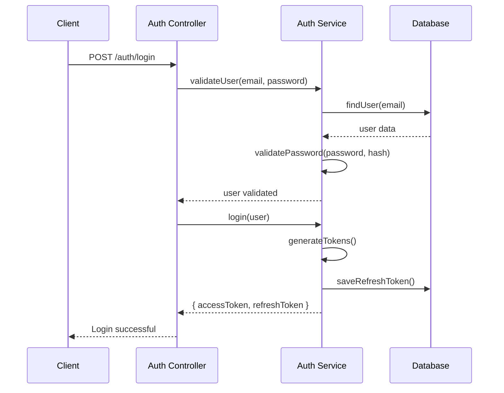

# 🔐 Authentication Module

The Authentication module provides secure user authentication and authorization using JWT tokens with refresh token support and role-based access control.

## 📋 Overview

- **Status:** ✅ Complete
- **Location:** `apps/api/src/auth/`
- **Dependencies:** Prisma, JWT, bcrypt, class-validator
- **Database Tables:** User, RefreshToken

## 🏗️ Architecture

### Components

```
auth/
├── auth.controller.ts      # Authentication endpoints
├── auth.service.ts         # Business logic
├── auth.module.ts         # Module configuration
├── decorators/
│   └── roles.decorator.ts  # Role-based access decorator
├── guards/
│   ├── jwt-auth.guard.ts   # JWT authentication guard
│   └── roles.guard.ts      # Role authorization guard
└── strategies/
    ├── jwt.strategy.ts     # JWT validation strategy
    └── local.strategy.ts   # Local auth strategy
```

### Authentication Flow



## 🔑 Features

### Core Authentication
- ✅ User registration with email validation
- ✅ User login with email/password
- ✅ JWT access tokens (15 minutes expiry)
- ✅ Refresh tokens (7 days expiry)
- ✅ Token refresh mechanism
- ✅ Secure password hashing (bcrypt)
- ✅ Account activation via email
- ✅ Password reset functionality

### Role-Based Access Control (RBAC)
- ✅ Three user roles: `CLIENT`, `PROVIDER`, `ADMIN`
- ✅ Route protection with `@Roles()` decorator
- ✅ Role-based middleware
- ✅ Permission validation

### Security Features
- ✅ Password strength validation
- ✅ Rate limiting on auth endpoints
- ✅ Secure token storage
- ✅ Automatic token cleanup
- ✅ CORS configuration
- ✅ Input sanitization

## 🛠️ API Endpoints

### Authentication Endpoints

#### Register User
```http
POST /auth/register
Content-Type: application/json

{
  "email": "user@example.com",
  "password": "SecurePassword123!",
  "firstName": "John",
  "lastName": "Doe",
  "role": "CLIENT"
}
```

**Response:**
```json
{
  "success": true,
  "message": "User registered successfully",
  "user": {
    "id": "uuid",
    "email": "user@example.com",
    "firstName": "John",
    "lastName": "Doe",
    "role": "CLIENT",
    "isActive": false
  }
}
```

#### Login
```http
POST /auth/login
Content-Type: application/json

{
  "email": "user@example.com",
  "password": "SecurePassword123!"
}
```

**Response:**
```json
{
  "success": true,
  "accessToken": "eyJhbGciOiJIUzI1NiIsInR5cCI6IkpXVCJ9...",
  "refreshToken": "eyJhbGciOiJIUzI1NiIsInR5cCI6IkpXVCJ9...",
  "user": {
    "id": "uuid",
    "email": "user@example.com",
    "firstName": "John",
    "lastName": "Doe",
    "role": "CLIENT"
  }
}
```

#### Refresh Token
```http
POST /auth/refresh
Content-Type: application/json

{
  "refreshToken": "eyJhbGciOiJIUzI1NiIsInR5cCI6IkpXVCJ9..."
}
```

#### Logout
```http
POST /auth/logout
Authorization: Bearer <access_token>
Content-Type: application/json

{
  "refreshToken": "eyJhbGciOiJIUzI1NiIsInR5cCI6IkpXVCJ9..."
}
```

#### Password Reset Request
```http
POST /auth/forgot-password
Content-Type: application/json

{
  "email": "user@example.com"
}
```

#### Password Reset
```http
POST /auth/reset-password
Content-Type: application/json

{
  "token": "reset_token_here",
  "newPassword": "NewSecurePassword123!"
}
```

### Protected Endpoints

#### Get Current User
```http
GET /auth/me
Authorization: Bearer <access_token>
```

#### Change Password
```http
PUT /auth/change-password
Authorization: Bearer <access_token>
Content-Type: application/json

{
  "currentPassword": "CurrentPassword123!",
  "newPassword": "NewPassword123!"
}
```

## 🔒 Security Implementation

### JWT Configuration
```typescript
// JWT Access Token
{
  secret: process.env.JWT_SECRET,
  expiresIn: '15m',
  algorithm: 'HS256'
}

// JWT Refresh Token
{
  secret: process.env.JWT_REFRESH_SECRET,
  expiresIn: '7d',
  algorithm: 'HS256'
}
```

### Password Security
- **Hashing:** bcrypt with salt rounds: 12
- **Validation:** Minimum 8 characters, uppercase, lowercase, number, special char
- **Storage:** Never store plain text passwords

### Token Management
- **Access Token:** Short-lived (15 minutes)
- **Refresh Token:** Long-lived (7 days)
- **Storage:** Refresh tokens stored in database with expiry
- **Cleanup:** Automatic cleanup of expired tokens

## 🎯 Usage Examples

### Protecting Routes with Roles

```typescript
import { Controller, Get, UseGuards } from '@nestjs/common';
import { JwtAuthGuard } from './auth/guards/jwt-auth.guard';
import { RolesGuard } from './auth/guards/roles.guard';
import { Roles } from './auth/decorators/roles.decorator';
import { UserRole } from '@prisma/client';

@Controller('admin')
@UseGuards(JwtAuthGuard, RolesGuard)
export class AdminController {
  @Get('users')
  @Roles(UserRole.ADMIN)
  getAllUsers() {
    // Only admins can access this endpoint
  }

  @Get('providers')
  @Roles(UserRole.ADMIN, UserRole.PROVIDER)
  getProviders() {
    // Admins and providers can access this endpoint
  }
}
```

### Getting Current User in Controllers

```typescript
import { Controller, Get, UseGuards } from '@nestjs/common';
import { JwtAuthGuard } from './auth/guards/jwt-auth.guard';
import { CurrentUser } from './auth/decorators/current-user.decorator';
import { User } from '@prisma/client';

@Controller('profile')
@UseGuards(JwtAuthGuard)
export class ProfileController {
  @Get()
  getProfile(@CurrentUser() user: User) {
    return user;
  }
}
```

### Frontend Integration

```typescript
// Login function
async function login(email: string, password: string) {
  const response = await fetch('/api/auth/login', {
    method: 'POST',
    headers: { 'Content-Type': 'application/json' },
    body: JSON.stringify({ email, password })
  });
  
  const data = await response.json();
  
  if (data.success) {
    // Store tokens securely
    localStorage.setItem('accessToken', data.accessToken);
    localStorage.setItem('refreshToken', data.refreshToken);
    return data.user;
  }
  
  throw new Error(data.message);
}

// API request with token
async function makeAuthenticatedRequest(url: string, options: RequestInit = {}) {
  const token = localStorage.getItem('accessToken');
  
  return fetch(url, {
    ...options,
    headers: {
      ...options.headers,
      'Authorization': `Bearer ${token}`
    }
  });
}
```

## 📊 Database Schema

### User Table
```sql
CREATE TABLE "User" (
    "id" TEXT NOT NULL,
    "email" TEXT NOT NULL,
    "password" TEXT NOT NULL,
    "firstName" TEXT NOT NULL,
    "lastName" TEXT NOT NULL,
    "role" "UserRole" NOT NULL DEFAULT 'CLIENT',
    "isActive" BOOLEAN NOT NULL DEFAULT false,
    "emailVerified" BOOLEAN NOT NULL DEFAULT false,
    "createdAt" TIMESTAMP(3) NOT NULL DEFAULT CURRENT_TIMESTAMP,
    "updatedAt" TIMESTAMP(3) NOT NULL,
    
    CONSTRAINT "User_pkey" PRIMARY KEY ("id")
);

CREATE UNIQUE INDEX "User_email_key" ON "User"("email");
```

### RefreshToken Table
```sql
CREATE TABLE "RefreshToken" (
    "id" TEXT NOT NULL,
    "token" TEXT NOT NULL,
    "userId" TEXT NOT NULL,
    "expiresAt" TIMESTAMP(3) NOT NULL,
    "createdAt" TIMESTAMP(3) NOT NULL DEFAULT CURRENT_TIMESTAMP,
    
    CONSTRAINT "RefreshToken_pkey" PRIMARY KEY ("id")
);

CREATE UNIQUE INDEX "RefreshToken_token_key" ON "RefreshToken"("token");
```

## 🧪 Testing

### Unit Tests
```bash
# Run auth module tests
npm run test -- --testPathPattern=auth

# Run with coverage
npm run test:cov -- --testPathPattern=auth
```

### Integration Tests
```bash
# Run auth e2e tests
npm run test:e2e -- --testPathPattern=auth
```

### Test Examples
```typescript
describe('AuthController', () => {
  it('should register a new user', async () => {
    const registerDto = {
      email: 'test@example.com',
      password: 'Password123!',
      firstName: 'Test',
      lastName: 'User',
      role: 'CLIENT'
    };

    const response = await request(app.getHttpServer())
      .post('/auth/register')
      .send(registerDto)
      .expect(201);

    expect(response.body.success).toBe(true);
    expect(response.body.user.email).toBe(registerDto.email);
  });
});
```

## 🔧 Configuration

### Environment Variables
```env
# JWT Configuration
JWT_SECRET=your-jwt-secret-key
JWT_REFRESH_SECRET=your-jwt-refresh-secret-key
JWT_EXPIRES_IN=15m
JWT_REFRESH_EXPIRES_IN=7d

# Email Configuration (for password reset)
SMTP_HOST=smtp.gmail.com
SMTP_PORT=587
SMTP_USER=your-email@gmail.com
SMTP_PASS=your-app-password

# Application
APP_URL=http://localhost:3000
API_URL=http://localhost:3001
```

### Module Configuration
```typescript
@Module({
  imports: [
    JwtModule.register({
      secret: process.env.JWT_SECRET,
      signOptions: { expiresIn: process.env.JWT_EXPIRES_IN },
    }),
    PassportModule,
    PrismaModule,
  ],
  controllers: [AuthController],
  providers: [
    AuthService,
    JwtStrategy,
    LocalStrategy,
    JwtAuthGuard,
    RolesGuard,
  ],
  exports: [AuthService, JwtAuthGuard, RolesGuard],
})
export class AuthModule {}
```

## 🚀 Deployment Considerations

### Production Settings
- Use strong JWT secrets (256-bit)
- Enable HTTPS only
- Configure proper CORS settings
- Set up rate limiting
- Enable audit logging
- Use environment-specific configurations

### Monitoring
- Track failed login attempts
- Monitor token usage patterns
- Set up alerts for suspicious activity
- Log authentication events

## 📚 Related Documentation

- [User Management Module](./users.md)
- [API Reference](../api/auth.md)
- [Security Best Practices](../security/authentication.md)
- [Environment Configuration](../deployment/environment.md)

## 🐛 Troubleshooting

### Common Issues

1. **Token Expired Error**
   - Check token expiry time
   - Implement token refresh logic
   - Verify system clock synchronization

2. **Invalid Credentials**
   - Verify password hashing
   - Check email case sensitivity
   - Ensure user is active

3. **CORS Issues**
   - Configure allowed origins
   - Set proper headers
   - Check preflight requests

### Debug Commands
```bash
# Check JWT token
node -e "console.log(require('jsonwebtoken').decode('YOUR_TOKEN'))"

# Verify password hash
node -e "console.log(require('bcrypt').compareSync('password', 'hash'))"
``` 