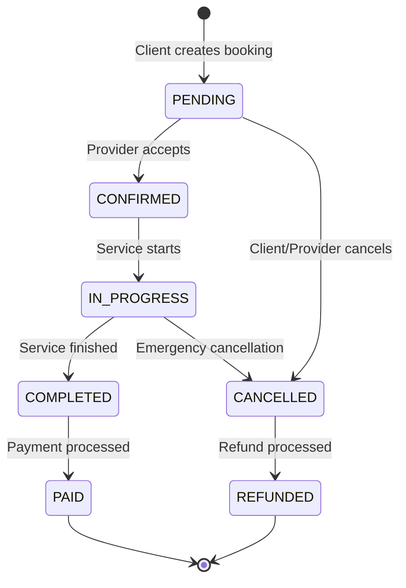

# 📅 Bookings Module

The Bookings module manages service appointments, scheduling, and booking lifecycle from creation to completion, including payment processing and status tracking.

## 📋 Overview

- **Status:** ✅ Complete
- **Location:** `apps/api/src/bookings/`
- **Dependencies:** Prisma, Auth Module, Services Module, Payments Module
- **Database Tables:** Booking, BookingStatus, BookingPayment

## 🏗️ Architecture

### Components

```
bookings/
├── bookings.controller.ts  # Booking endpoints
├── bookings.service.ts     # Business logic
├── bookings.module.ts      # Module configuration
└── dto/
    ├── create-booking.dto.ts    # Booking creation validation
    ├── update-booking.dto.ts    # Booking update validation
    ├── booking-filter.dto.ts    # Search and filter validation
    └── booking-response.dto.ts  # Response formatting
```

### Booking Lifecycle



## 🔑 Features

### Booking Management
- ✅ Create, read, update, cancel bookings
- ✅ Multi-status booking lifecycle
- ✅ Date and time scheduling
- ✅ Service duration calculation
- ✅ Automatic booking expiration
- ✅ Booking history and tracking

### Payment Integration
- ✅ Upfront payment processing
- ✅ Hold and capture payments
- ✅ Automatic refund handling
- ✅ Platform fee calculation (5%)
- ✅ Provider payout management
- ✅ Payment dispute handling

### Notification System
- ✅ Email notifications for status changes
- ✅ SMS reminders (24h before)
- ✅ Push notifications (mobile apps)
- ✅ Provider new booking alerts
- ✅ Client booking confirmations

### Calendar Integration
- ✅ Provider availability management
- ✅ Time slot blocking
- ✅ Recurring availability patterns
- ✅ Holiday and vacation handling
- ✅ Timezone support

## 🛠️ API Endpoints

### Booking CRUD Endpoints

#### Create Booking
```http
POST /bookings
Authorization: Bearer <access_token>
Content-Type: application/json

{
  "serviceId": "service-uuid",
  "scheduledDate": "2024-02-15T10:00:00Z",
  "duration": 120,
  "notes": "Please bring cleaning supplies",
  "address": {
    "street": "123 Main St",
    "city": "Miami",
    "state": "FL",
    "zipCode": "33101"
  },
  "paymentMethodId": "pm_1234567890"
}
```

**Response:**
```json
{
  "success": true,
  "booking": {
    "id": "booking-uuid",
    "serviceId": "service-uuid",
    "clientId": "client-uuid",
    "providerId": "provider-uuid",
    "status": "PENDING",
    "scheduledDate": "2024-02-15T10:00:00Z",
    "duration": 120,
    "totalAmount": 80.00,
    "platformFee": 4.00,
    "providerAmount": 76.00,
    "paymentStatus": "PENDING",
    "service": {
      "title": "Professional House Cleaning",
      "category": "HOUSE_CLEANING",
      "price": 80.00
    },
    "provider": {
      "firstName": "Jane",
      "lastName": "Smith",
      "businessName": "Smith Cleaning Services"
    },
    "createdAt": "2024-01-15T10:00:00Z"
  }
}
```

#### Get User Bookings
```http
GET /bookings/my-bookings?status=CONFIRMED&page=1&limit=10
Authorization: Bearer <access_token>
```

#### Get Provider Bookings
```http
GET /bookings/provider-bookings?status=PENDING&date=2024-02-15
Authorization: Bearer <access_token>
```

#### Get Booking Details
```http
GET /bookings/:id
Authorization: Bearer <access_token>
```

#### Update Booking Status
```http
PUT /bookings/:id/status
Authorization: Bearer <access_token>
Content-Type: application/json

{
  "status": "CONFIRMED",
  "notes": "Confirmed for 10:00 AM"
}
```

#### Cancel Booking
```http
DELETE /bookings/:id
Authorization: Bearer <access_token>
Content-Type: application/json

{
  "reason": "Schedule conflict",
  "refundRequested": true
}
```

### Scheduling Endpoints

#### Check Availability
```http
GET /bookings/availability/:serviceId?date=2024-02-15&duration=120
```

**Response:**
```json
{
  "success": true,
  "availability": [
    {
      "startTime": "09:00:00",
      "endTime": "11:00:00",
      "available": true
    },
    {
      "startTime": "11:00:00",
      "endTime": "13:00:00",
      "available": false,
      "reason": "Already booked"
    },
    {
      "startTime": "14:00:00",
      "endTime": "16:00:00",
      "available": true
    }
  ]
}
```

#### Get Provider Calendar
```http
GET /bookings/calendar?startDate=2024-02-01&endDate=2024-02-29
Authorization: Bearer <access_token>
```

#### Update Availability
```http
PUT /bookings/availability
Authorization: Bearer <access_token>
Content-Type: application/json

{
  "weeklySchedule": {
    "monday": { "start": "09:00", "end": "17:00", "available": true },
    "tuesday": { "start": "09:00", "end": "17:00", "available": true },
    "wednesday": { "available": false },
    "thursday": { "start": "09:00", "end": "17:00", "available": true },
    "friday": { "start": "09:00", "end": "17:00", "available": true },
    "saturday": { "start": "10:00", "end": "14:00", "available": true },
    "sunday": { "available": false }
  },
  "exceptions": [
    {
      "date": "2024-02-14",
      "available": false,
      "reason": "Valentine's Day - Closed"
    }
  ]
}
```

### Analytics Endpoints

#### Get Booking Statistics
```http
GET /bookings/stats?period=month&year=2024&month=2
Authorization: Bearer <access_token>
```

**Response:**
```json
{
  "success": true,
  "stats": {
    "totalBookings": 45,
    "confirmedBookings": 38,
    "cancelledBookings": 7,
    "completedBookings": 35,
    "totalRevenue": 2800.00,
    "averageBookingValue": 80.00,
    "bookingsByStatus": {
      "PENDING": 5,
      "CONFIRMED": 10,
      "COMPLETED": 25,
      "CANCELLED": 5
    },
    "bookingsByDay": [
      { "date": "2024-02-01", "count": 3 },
      { "date": "2024-02-02", "count": 2 }
    ]
  }
}
```

## 📊 Database Schema

### Booking Table
```sql
CREATE TABLE "Booking" (
    "id" TEXT NOT NULL,
    "serviceId" TEXT NOT NULL,
    "clientId" TEXT NOT NULL,
    "providerId" TEXT NOT NULL,
    "status" "BookingStatus" NOT NULL DEFAULT 'PENDING',
    "scheduledDate" TIMESTAMP(3) NOT NULL,
    "duration" INTEGER NOT NULL,
    "totalAmount" DECIMAL(10,2) NOT NULL,
    "platformFee" DECIMAL(10,2) NOT NULL,
    "providerAmount" DECIMAL(10,2) NOT NULL,
    "paymentStatus" "PaymentStatus" NOT NULL DEFAULT 'PENDING',
    "paymentIntentId" TEXT,
    "notes" TEXT,
    "cancellationReason" TEXT,
    "address" JSONB NOT NULL,
    "completedAt" TIMESTAMP(3),
    "cancelledAt" TIMESTAMP(3),
    "createdAt" TIMESTAMP(3) NOT NULL DEFAULT CURRENT_TIMESTAMP,
    "updatedAt" TIMESTAMP(3) NOT NULL,
    
    CONSTRAINT "Booking_pkey" PRIMARY KEY ("id")
);
```

### BookingStatus Enum
```typescript
export enum BookingStatus {
  PENDING = 'PENDING',           // Awaiting provider confirmation
  CONFIRMED = 'CONFIRMED',       // Provider accepted booking
  IN_PROGRESS = 'IN_PROGRESS',   // Service is being performed
  COMPLETED = 'COMPLETED',       // Service completed successfully
  CANCELLED = 'CANCELLED',       // Booking cancelled by client/provider
  NO_SHOW = 'NO_SHOW',          // Client didn't show up
  REFUNDED = 'REFUNDED'          // Payment refunded
}
```

### PaymentStatus Enum
```typescript
export enum PaymentStatus {
  PENDING = 'PENDING',           // Payment not yet processed
  AUTHORIZED = 'AUTHORIZED',     // Payment authorized (hold)
  CAPTURED = 'CAPTURED',         // Payment captured
  FAILED = 'FAILED',            // Payment failed
  REFUNDED = 'REFUNDED',        // Payment refunded
  DISPUTED = 'DISPUTED'         // Payment disputed
}
```

### ProviderAvailability Table
```sql
CREATE TABLE "ProviderAvailability" (
    "id" TEXT NOT NULL,
    "providerId" TEXT NOT NULL,
    "dayOfWeek" INTEGER NOT NULL,
    "startTime" TIME NOT NULL,
    "endTime" TIME NOT NULL,
    "isAvailable" BOOLEAN NOT NULL DEFAULT true,
    "createdAt" TIMESTAMP(3) NOT NULL DEFAULT CURRENT_TIMESTAMP,
    "updatedAt" TIMESTAMP(3) NOT NULL,
    
    CONSTRAINT "ProviderAvailability_pkey" PRIMARY KEY ("id")
);
```

## 🎯 Usage Examples

### Creating a Booking (Client)

```typescript
// React component for booking creation
import { useMutation } from '@tanstack/react-query';
import { createBooking } from '../api/bookings';

function BookingForm({ service }: { service: Service }) {
  const [selectedDate, setSelectedDate] = useState<Date>();
  const [selectedTime, setSelectedTime] = useState<string>('');
  const [address, setAddress] = useState<Address>();

  const createBookingMutation = useMutation({
    mutationFn: createBooking,
    onSuccess: (booking) => {
      toast.success('Booking created successfully');
      navigate(`/bookings/${booking.id}`);
    },
    onError: (error) => {
      toast.error('Failed to create booking');
    }
  });

  const handleSubmit = (e: React.FormEvent) => {
    e.preventDefault();
    
    const bookingData = {
      serviceId: service.id,
      scheduledDate: new Date(`${selectedDate}T${selectedTime}`),
      duration: service.duration,
      address,
      paymentMethodId: selectedPaymentMethod
    };

    createBookingMutation.mutate(bookingData);
  };

  return (
    <form onSubmit={handleSubmit}>
      <div className="service-info">
        <h3>{service.title}</h3>
        <p>Price: ${service.price}</p>
        <p>Duration: {service.duration} minutes</p>
      </div>

      <DatePicker
        selected={selectedDate}
        onChange={setSelectedDate}
        minDate={new Date()}
        required
      />

      <TimeSlotPicker
        serviceId={service.id}
        date={selectedDate}
        onTimeSelect={setSelectedTime}
        duration={service.duration}
      />

      <AddressForm
        address={address}
        onChange={setAddress}
        required
      />

      <PaymentMethodSelector
        onSelect={setSelectedPaymentMethod}
        required
      />

      <button 
        type="submit" 
        disabled={createBookingMutation.isLoading}
      >
        {createBookingMutation.isLoading ? 'Creating...' : 'Book Service'}
      </button>
    </form>
  );
}
```

### Managing Bookings (Provider)

```typescript
// Provider booking management component
function ProviderBookings() {
  const [statusFilter, setStatusFilter] = useState<BookingStatus>('PENDING');
  
  const { data: bookings, isLoading } = useQuery({
    queryKey: ['provider-bookings', statusFilter],
    queryFn: () => getProviderBookings({ status: statusFilter })
  });

  const updateBookingMutation = useMutation({
    mutationFn: updateBookingStatus,
    onSuccess: () => {
      queryClient.invalidateQueries(['provider-bookings']);
      toast.success('Booking updated successfully');
    }
  });

  const handleStatusChange = (bookingId: string, status: BookingStatus) => {
    updateBookingMutation.mutate({ bookingId, status });
  };

  return (
    <div className="provider-bookings">
      <div className="filters">
        <select 
          value={statusFilter} 
          onChange={(e) => setStatusFilter(e.target.value as BookingStatus)}
        >
          <option value="PENDING">Pending</option>
          <option value="CONFIRMED">Confirmed</option>
          <option value="IN_PROGRESS">In Progress</option>
          <option value="COMPLETED">Completed</option>
        </select>
      </div>

      <div className="bookings-list">
        {bookings?.map(booking => (
          <BookingCard
            key={booking.id}
            booking={booking}
            onStatusChange={handleStatusChange}
          />
        ))}
      </div>
    </div>
  );
}

function BookingCard({ booking, onStatusChange }: BookingCardProps) {
  return (
    <div className="booking-card">
      <div className="booking-header">
        <h4>{booking.service.title}</h4>
        <span className={`status-badge ${booking.status.toLowerCase()}`}>
          {booking.status}
        </span>
      </div>

      <div className="booking-details">
        <p><strong>Client:</strong> {booking.client.firstName} {booking.client.lastName}</p>
        <p><strong>Date:</strong> {formatDate(booking.scheduledDate)}</p>
        <p><strong>Duration:</strong> {booking.duration} minutes</p>
        <p><strong>Amount:</strong> ${booking.totalAmount}</p>
        <p><strong>Address:</strong> {formatAddress(booking.address)}</p>
      </div>

      <div className="booking-actions">
        {booking.status === 'PENDING' && (
          <>
            <button 
              onClick={() => onStatusChange(booking.id, 'CONFIRMED')}
              className="btn-confirm"
            >
              Confirm
            </button>
            <button 
              onClick={() => onStatusChange(booking.id, 'CANCELLED')}
              className="btn-cancel"
            >
              Decline
            </button>
          </>
        )}
        
        {booking.status === 'CONFIRMED' && (
          <button 
            onClick={() => onStatusChange(booking.id, 'IN_PROGRESS')}
            className="btn-start"
          >
            Start Service
          </button>
        )}
        
        {booking.status === 'IN_PROGRESS' && (
          <button 
            onClick={() => onStatusChange(booking.id, 'COMPLETED')}
            className="btn-complete"
          >
            Complete Service
          </button>
        )}
      </div>
    </div>
  );
}
```

### Availability Management

```typescript
// Provider availability management
function AvailabilitySettings() {
  const [weeklySchedule, setWeeklySchedule] = useState<WeeklySchedule>();
  const [exceptions, setExceptions] = useState<AvailabilityException[]>([]);

  const updateAvailabilityMutation = useMutation({
    mutationFn: updateProviderAvailability,
    onSuccess: () => {
      toast.success('Availability updated successfully');
    }
  });

  const handleSave = () => {
    updateAvailabilityMutation.mutate({
      weeklySchedule,
      exceptions
    });
  };

  return (
    <div className="availability-settings">
      <h3>Weekly Schedule</h3>
      <div className="weekly-schedule">
        {Object.entries(weeklySchedule || {}).map(([day, schedule]) => (
          <div key={day} className="day-schedule">
            <label>{day.charAt(0).toUpperCase() + day.slice(1)}</label>
            <input
              type="checkbox"
              checked={schedule.available}
              onChange={(e) => updateDaySchedule(day, { available: e.target.checked })}
            />
            {schedule.available && (
              <>
                <input
                  type="time"
                  value={schedule.start}
                  onChange={(e) => updateDaySchedule(day, { start: e.target.value })}
                />
                <input
                  type="time"
                  value={schedule.end}
                  onChange={(e) => updateDaySchedule(day, { end: e.target.value })}
                />
              </>
            )}
          </div>
        ))}
      </div>

      <h3>Exceptions</h3>
      <div className="exceptions">
        {exceptions.map((exception, index) => (
          <div key={index} className="exception">
            <input
              type="date"
              value={exception.date}
              onChange={(e) => updateException(index, { date: e.target.value })}
            />
            <input
              type="checkbox"
              checked={exception.available}
              onChange={(e) => updateException(index, { available: e.target.checked })}
            />
            <input
              type="text"
              placeholder="Reason"
              value={exception.reason}
              onChange={(e) => updateException(index, { reason: e.target.value })}
            />
            <button onClick={() => removeException(index)}>Remove</button>
          </div>
        ))}
        <button onClick={addException}>Add Exception</button>
      </div>

      <button onClick={handleSave}>Save Availability</button>
    </div>
  );
}
```

## 🔒 Security & Business Rules

### Booking Permissions
- Clients can only view their own bookings
- Providers can only view bookings for their services
- Admins have full access to all bookings
- Status changes restricted by role and current status

### Payment Security
- All payments processed through Stripe
- Payment authorization before service confirmation
- Automatic refund for cancelled bookings
- Platform fee deducted from provider payments

### Booking Validation
- Minimum 2-hour advance booking
- Maximum 30-day advance booking
- Service area validation
- Provider availability verification
- Duplicate booking prevention

## 🧪 Testing

### Unit Tests
```typescript
describe('BookingsService', () => {
  it('should create booking with valid data', async () => {
    const createDto = {
      serviceId: 'service-123',
      scheduledDate: new Date('2024-02-15T10:00:00Z'),
      duration: 120,
      address: validAddress
    };

    const result = await service.create(clientId, createDto);
    
    expect(result.status).toBe(BookingStatus.PENDING);
    expect(result.totalAmount).toBe(80.00);
    expect(result.platformFee).toBe(4.00);
  });

  it('should reject booking outside business hours', async () => {
    const createDto = {
      serviceId: 'service-123',
      scheduledDate: new Date('2024-02-15T22:00:00Z'), // 10 PM
      duration: 120,
      address: validAddress
    };

    await expect(
      service.create(clientId, createDto)
    ).rejects.toThrow('Service not available at this time');
  });
});
```

### Integration Tests
```typescript
describe('Bookings API', () => {
  it('should create booking and process payment', async () => {
    const response = await request(app.getHttpServer())
      .post('/bookings')
      .set('Authorization', `Bearer ${clientToken}`)
      .send(validBookingData)
      .expect(201);

    expect(response.body.success).toBe(true);
    expect(response.body.booking.status).toBe('PENDING');
    expect(response.body.booking.paymentStatus).toBe('AUTHORIZED');
  });
});
```

## 🔧 Configuration

### Environment Variables
```env
# Booking settings
MIN_ADVANCE_BOOKING_HOURS=2
MAX_ADVANCE_BOOKING_DAYS=30
PLATFORM_FEE_PERCENTAGE=5.0
AUTO_CANCEL_PENDING_HOURS=24

# Payment settings
STRIPE_SECRET_KEY=sk_test_...
STRIPE_WEBHOOK_SECRET=whsec_...
PAYMENT_HOLD_DURATION_HOURS=24

# Notification settings
BOOKING_REMINDER_HOURS=24
SMS_ENABLED=true
EMAIL_ENABLED=true
PUSH_ENABLED=true
```

### Module Configuration
```typescript
@Module({
  imports: [
    PrismaModule,
    AuthModule,
    ServicesModule,
    PaymentsModule,
    NotificationsModule,
    ScheduleModule.forRoot(),
  ],
  controllers: [BookingsController],
  providers: [
    BookingsService,
    BookingNotificationService,
    BookingSchedulerService,
  ],
  exports: [BookingsService],
})
export class BookingsModule {}
```

## 📚 Related Documentation

- [Services Module](./services.md)
- [Payments Module](./payments.md)
- [Notifications Module](./notifications.md)
- [Calendar Integration Guide](../guides/calendar-integration.md)

## 🐛 Troubleshooting

### Common Issues

1. **Booking Creation Fails**
   - Check service availability
   - Verify payment method
   - Ensure valid address format

2. **Payment Authorization Issues**
   - Verify Stripe configuration
   - Check payment method validity
   - Ensure sufficient funds

3. **Notification Delivery Problems**
   - Check notification service status
   - Verify user contact information
   - Review notification preferences

### Debug Commands
```bash
# Check booking data
npm run prisma:studio

# Test payment processing
npm run test:payments

# View booking logs
npm run logs:bookings
``` 