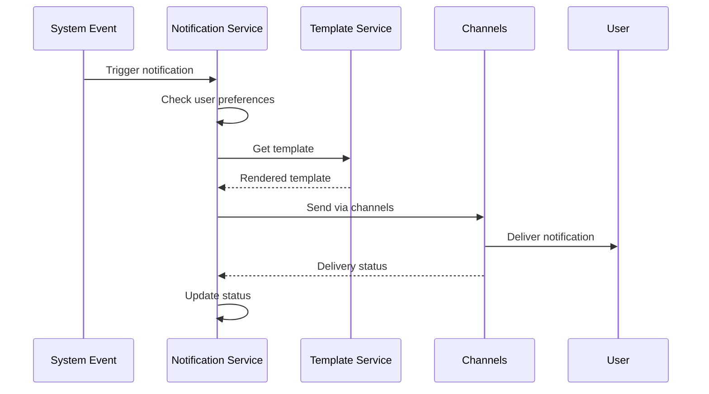

# 🔔 Notifications Module

The Notifications module handles multi-channel notification delivery including email, SMS, push notifications, and in-app notifications for all user interactions and system events.

## 📋 Overview

- **Status:** ❌ Pending
- **Location:** `apps/api/src/notifications/`
- **Dependencies:** Prisma, Auth Module, Email Service, SMS Service, Push Service
- **Database Tables:** Notification, NotificationPreference, NotificationTemplate

## 🏗️ Architecture

### Components

```
notifications/
├── notifications.controller.ts    # Notification endpoints
├── notifications.service.ts       # Business logic
├── notifications.module.ts        # Module configuration
├── channels/
│   ├── email.service.ts           # Email notifications
│   ├── sms.service.ts             # SMS notifications
│   ├── push.service.ts            # Push notifications
│   └── in-app.service.ts          # In-app notifications
├── templates/
│   ├── email/                     # Email templates
│   ├── sms/                       # SMS templates
│   └── push/                      # Push notification templates
└── dto/
    ├── send-notification.dto.ts   # Send notification validation
    ├── notification-filter.dto.ts # Notification filtering
    └── preferences.dto.ts         # User preferences
```

### Notification Flow



## 🔑 Features

### Multi-Channel Delivery
- ✅ Email notifications (Resend/SendGrid)
- ✅ SMS notifications (Twilio)
- ✅ Push notifications (Firebase/APNs)
- ✅ In-app notifications
- ✅ WhatsApp notifications (planned)
- ✅ Slack notifications (for admins)

### Notification Types
- ✅ **Booking Events** - Creation, confirmation, completion
- ✅ **Payment Events** - Success, failure, refunds
- ✅ **Service Events** - New reviews, messages
- ✅ **System Events** - Account updates, security alerts
- ✅ **Marketing Events** - Promotions, newsletters
- ✅ **Admin Events** - User reports, system alerts

### Advanced Features
- ✅ Template engine with variables
- ✅ User preference management
- ✅ Delivery tracking and analytics
- ✅ Retry logic for failed deliveries
- ✅ Rate limiting and throttling
- ✅ A/B testing for templates

### Personalization
- ✅ Dynamic content based on user data
- ✅ Localization (EN, ES, PT)
- ✅ Time zone awareness
- ✅ Device-specific formatting
- ✅ Behavioral targeting
- ✅ Frequency capping

## 🛠️ API Endpoints

### Notification Management

#### Send Notification
```http
POST /notifications/send
Authorization: Bearer <access_token>
Content-Type: application/json

{
  "userId": "user-uuid",
  "type": "booking_confirmed",
  "channels": ["email", "push"],
  "data": {
    "bookingId": "booking-uuid",
    "serviceName": "House Cleaning",
    "scheduledDate": "2024-02-15T10:00:00Z",
    "providerName": "Smith Cleaning Services"
  },
  "priority": "high",
  "scheduleAt": "2024-02-14T20:00:00Z"
}
```

**Response:**
```json
{
  "success": true,
  "notification": {
    "id": "notif-uuid",
    "userId": "user-uuid",
    "type": "booking_confirmed",
    "status": "sent",
    "channels": [
      {
        "type": "email",
        "status": "delivered",
        "sentAt": "2024-02-14T20:00:00Z"
      },
      {
        "type": "push",
        "status": "delivered",
        "sentAt": "2024-02-14T20:00:05Z"
      }
    ],
    "createdAt": "2024-02-14T20:00:00Z"
  }
}
```

#### Get User Notifications
```http
GET /notifications?page=1&limit=20&status=unread&type=booking
Authorization: Bearer <access_token>
```

**Response:**
```json
{
  "success": true,
  "notifications": [
    {
      "id": "notif-uuid",
      "type": "booking_confirmed",
      "title": "Booking Confirmed",
      "message": "Your house cleaning service has been confirmed for Feb 15, 2024 at 10:00 AM",
      "data": {
        "bookingId": "booking-uuid",
        "actionUrl": "/bookings/booking-uuid"
      },
      "status": "unread",
      "createdAt": "2024-02-14T20:00:00Z"
    }
  ],
  "pagination": {
    "page": 1,
    "limit": 20,
    "total": 45,
    "pages": 3
  },
  "unreadCount": 12
}
```

#### Mark as Read
```http
PUT /notifications/:id/read
Authorization: Bearer <access_token>
```

#### Mark All as Read
```http
PUT /notifications/read-all
Authorization: Bearer <access_token>
```

#### Delete Notification
```http
DELETE /notifications/:id
Authorization: Bearer <access_token>
```

### User Preferences

#### Get Notification Preferences
```http
GET /notifications/preferences
Authorization: Bearer <access_token>
```

**Response:**
```json
{
  "success": true,
  "preferences": {
    "email": {
      "enabled": true,
      "types": {
        "booking_events": true,
        "payment_events": true,
        "messages": true,
        "marketing": false,
        "system_updates": true
      }
    },
    "sms": {
      "enabled": true,
      "types": {
        "booking_events": true,
        "payment_events": true,
        "messages": false,
        "marketing": false,
        "system_updates": false
      }
    },
    "push": {
      "enabled": true,
      "types": {
        "booking_events": true,
        "payment_events": true,
        "messages": true,
        "marketing": true,
        "system_updates": true
      }
    },
    "in_app": {
      "enabled": true,
      "types": {
        "booking_events": true,
        "payment_events": true,
        "messages": true,
        "marketing": true,
        "system_updates": true
      }
    },
    "quietHours": {
      "enabled": true,
      "startTime": "22:00",
      "endTime": "08:00",
      "timezone": "America/New_York"
    }
  }
}
```

#### Update Preferences
```http
PUT /notifications/preferences
Authorization: Bearer <access_token>
Content-Type: application/json

{
  "email": {
    "enabled": true,
    "types": {
      "booking_events": true,
      "payment_events": true,
      "messages": true,
      "marketing": false
    }
  },
  "quietHours": {
    "enabled": true,
    "startTime": "23:00",
    "endTime": "07:00"
  }
}
```

### Push Notification Management

#### Register Device
```http
POST /notifications/devices
Authorization: Bearer <access_token>
Content-Type: application/json

{
  "token": "fcm-device-token",
  "platform": "ios",
  "appVersion": "1.0.0",
  "deviceInfo": {
    "model": "iPhone 12",
    "osVersion": "15.0"
  }
}
```

#### Update Device Token
```http
PUT /notifications/devices/:deviceId
Authorization: Bearer <access_token>
Content-Type: application/json

{
  "token": "new-fcm-token"
}
```

#### Unregister Device
```http
DELETE /notifications/devices/:deviceId
Authorization: Bearer <access_token>
```

### Admin Endpoints

#### Send Bulk Notifications
```http
POST /admin/notifications/bulk
Authorization: Bearer <admin_token>
Content-Type: application/json

{
  "userIds": ["user-1", "user-2"],
  "type": "system_maintenance",
  "channels": ["email", "in_app"],
  "template": "maintenance_notice",
  "data": {
    "maintenanceDate": "2024-02-20T02:00:00Z",
    "duration": "2 hours"
  }
}
```

#### Get Notification Analytics
```http
GET /admin/notifications/analytics?period=week&type=booking_events
Authorization: Bearer <admin_token>
```

**Response:**
```json
{
  "success": true,
  "analytics": {
    "totalSent": 1245,
    "deliveryRate": 98.5,
    "openRate": 65.2,
    "clickRate": 12.8,
    "unsubscribeRate": 0.3,
    "channelBreakdown": {
      "email": {
        "sent": 800,
        "delivered": 792,
        "opened": 516,
        "clicked": 98
      },
      "push": {
        "sent": 445,
        "delivered": 434,
        "opened": 298,
        "clicked": 62
      }
    },
    "dailyStats": [
      {
        "date": "2024-02-14",
        "sent": 156,
        "delivered": 154,
        "opened": 98
      }
    ]
  }
}
```

## 📊 Database Schema

### Notification Table
```sql
CREATE TABLE "Notification" (
    "id" TEXT NOT NULL,
    "userId" TEXT NOT NULL,
    "type" TEXT NOT NULL,
    "title" TEXT NOT NULL,
    "message" TEXT NOT NULL,
    "data" JSONB,
    "channels" TEXT[],
    "status" "NotificationStatus" NOT NULL DEFAULT 'pending',
    "priority" "NotificationPriority" NOT NULL DEFAULT 'normal',
    "scheduledAt" TIMESTAMP(3),
    "sentAt" TIMESTAMP(3),
    "readAt" TIMESTAMP(3),
    "clickedAt" TIMESTAMP(3),
    "createdAt" TIMESTAMP(3) NOT NULL DEFAULT CURRENT_TIMESTAMP,
    "updatedAt" TIMESTAMP(3) NOT NULL,
    
    CONSTRAINT "Notification_pkey" PRIMARY KEY ("id")
);
```

### NotificationPreference Table
```sql
CREATE TABLE "NotificationPreference" (
    "id" TEXT NOT NULL,
    "userId" TEXT NOT NULL,
    "channel" "NotificationChannel" NOT NULL,
    "type" TEXT NOT NULL,
    "enabled" BOOLEAN NOT NULL DEFAULT true,
    "createdAt" TIMESTAMP(3) NOT NULL DEFAULT CURRENT_TIMESTAMP,
    "updatedAt" TIMESTAMP(3) NOT NULL,
    
    CONSTRAINT "NotificationPreference_pkey" PRIMARY KEY ("id")
);
```

### NotificationTemplate Table
```sql
CREATE TABLE "NotificationTemplate" (
    "id" TEXT NOT NULL,
    "name" TEXT NOT NULL,
    "type" TEXT NOT NULL,
    "channel" "NotificationChannel" NOT NULL,
    "language" TEXT NOT NULL DEFAULT 'en',
    "subject" TEXT,
    "title" TEXT,
    "body" TEXT NOT NULL,
    "variables" TEXT[],
    "isActive" BOOLEAN NOT NULL DEFAULT true,
    "createdAt" TIMESTAMP(3) NOT NULL DEFAULT CURRENT_TIMESTAMP,
    "updatedAt" TIMESTAMP(3) NOT NULL,
    
    CONSTRAINT "NotificationTemplate_pkey" PRIMARY KEY ("id")
);
```

### DeviceToken Table
```sql
CREATE TABLE "DeviceToken" (
    "id" TEXT NOT NULL,
    "userId" TEXT NOT NULL,
    "token" TEXT NOT NULL,
    "platform" "DevicePlatform" NOT NULL,
    "appVersion" TEXT,
    "deviceInfo" JSONB,
    "isActive" BOOLEAN NOT NULL DEFAULT true,
    "lastUsedAt" TIMESTAMP(3),
    "createdAt" TIMESTAMP(3) NOT NULL DEFAULT CURRENT_TIMESTAMP,
    "updatedAt" TIMESTAMP(3) NOT NULL,
    
    CONSTRAINT "DeviceToken_pkey" PRIMARY KEY ("id")
);
```

### Notification Enums
```typescript
export enum NotificationStatus {
  PENDING = 'pending',
  SENT = 'sent',
  DELIVERED = 'delivered',
  FAILED = 'failed',
  READ = 'read'
}

export enum NotificationPriority {
  LOW = 'low',
  NORMAL = 'normal',
  HIGH = 'high',
  URGENT = 'urgent'
}

export enum NotificationChannel {
  EMAIL = 'email',
  SMS = 'sms',
  PUSH = 'push',
  IN_APP = 'in_app',
  WHATSAPP = 'whatsapp'
}

export enum DevicePlatform {
  IOS = 'ios',
  ANDROID = 'android',
  WEB = 'web'
}
```

## 🎯 Usage Examples

### Sending Notifications (Backend)

```typescript
// Service method to send booking confirmation
async sendBookingConfirmation(booking: Booking) {
  const notification = {
    userId: booking.clientId,
    type: 'booking_confirmed',
    channels: ['email', 'push'],
    data: {
      bookingId: booking.id,
      serviceName: booking.service.title,
      providerName: booking.provider.businessName,
      scheduledDate: booking.scheduledDate,
      amount: booking.totalAmount
    },
    priority: 'high' as NotificationPriority
  };

  return await this.notificationsService.send(notification);
}

// Event listener for booking events
@EventPattern('booking.confirmed')
async handleBookingConfirmed(data: { booking: Booking }) {
  await this.sendBookingConfirmation(data.booking);
  
  // Also notify provider
  await this.notificationsService.send({
    userId: data.booking.providerId,
    type: 'booking_received',
    channels: ['email', 'push'],
    data: {
      bookingId: data.booking.id,
      clientName: data.booking.client.firstName,
      serviceName: data.booking.service.title,
      scheduledDate: data.booking.scheduledDate
    }
  });
}
```

### Frontend Notifications

```typescript
// React notification component
import { useQuery, useMutation, useQueryClient } from '@tanstack/react-query';
import { getNotifications, markAsRead } from '../api/notifications';

function NotificationCenter() {
  const queryClient = useQueryClient();
  
  const { data: notifications, isLoading } = useQuery({
    queryKey: ['notifications'],
    queryFn: () => getNotifications({ status: 'unread' }),
    refetchInterval: 30000 // Poll every 30 seconds
  });

  const markReadMutation = useMutation({
    mutationFn: markAsRead,
    onSuccess: () => {
      queryClient.invalidateQueries(['notifications']);
    }
  });

  const handleNotificationClick = (notification: Notification) => {
    if (notification.status === 'unread') {
      markReadMutation.mutate(notification.id);
    }
    
    // Navigate to relevant page
    if (notification.data?.actionUrl) {
      navigate(notification.data.actionUrl);
    }
  };

  return (
    <div className="notification-center">
      <div className="notification-header">
        <h3>Notifications</h3>
        <span className="unread-count">{notifications?.unreadCount || 0}</span>
      </div>

      <div className="notifications-list">
        {notifications?.notifications.map(notification => (
          <NotificationItem
            key={notification.id}
            notification={notification}
            onClick={handleNotificationClick}
          />
        ))}
      </div>
    </div>
  );
}

function NotificationItem({ notification, onClick }: NotificationItemProps) {
  return (
    <div 
      className={`notification-item ${notification.status === 'unread' ? 'unread' : ''}`}
      onClick={() => onClick(notification)}
    >
      <div className="notification-icon">
        {getNotificationIcon(notification.type)}
      </div>
      
      <div className="notification-content">
        <h4>{notification.title}</h4>
        <p>{notification.message}</p>
        <span className="notification-time">{formatTime(notification.createdAt)}</span>
      </div>
      
      {notification.status === 'unread' && (
        <div className="unread-indicator" />
      )}
    </div>
  );
}
```

### React Native Push Notifications

```typescript
// React Native push notification setup
import messaging from '@react-native-firebase/messaging';
import { registerDeviceToken } from '../api/notifications';

class NotificationService {
  async initialize() {
    // Request permission
    const authStatus = await messaging().requestPermission();
    const enabled = authStatus === messaging.AuthorizationStatus.AUTHORIZED ||
                   authStatus === messaging.AuthorizationStatus.PROVISIONAL;

    if (enabled) {
      // Get device token
      const token = await messaging().getToken();
      
      // Register with backend
      await registerDeviceToken({
        token,
        platform: Platform.OS,
        appVersion: DeviceInfo.getVersion(),
        deviceInfo: {
          model: DeviceInfo.getModel(),
          osVersion: DeviceInfo.getSystemVersion()
        }
      });

      // Handle token refresh
      messaging().onTokenRefresh(async (newToken) => {
        await this.updateDeviceToken(newToken);
      });
    }
  }

  setupMessageHandlers() {
    // Handle foreground messages
    messaging().onMessage(async (remoteMessage) => {
      this.showLocalNotification(remoteMessage);
    });

    // Handle background messages
    messaging().onNotificationOpenedApp((remoteMessage) => {
      this.handleNotificationPress(remoteMessage);
    });

    // Handle app launch from notification
    messaging().getInitialNotification().then((remoteMessage) => {
      if (remoteMessage) {
        this.handleNotificationPress(remoteMessage);
      }
    });
  }

  showLocalNotification(message: any) {
    PushNotification.localNotification({
      title: message.notification.title,
      message: message.notification.body,
      data: message.data,
      userInfo: message.data
    });
  }

  handleNotificationPress(message: any) {
    if (message.data?.actionUrl) {
      // Navigate to relevant screen
      NavigationService.navigate(message.data.actionUrl);
    }
  }
}
```

### Notification Preferences

```typescript
// Notification preferences component
function NotificationPreferences() {
  const [preferences, setPreferences] = useState<NotificationPreferences>();

  const { data: userPreferences } = useQuery({
    queryKey: ['notification-preferences'],
    queryFn: getNotificationPreferences,
    onSuccess: setPreferences
  });

  const updatePreferencesMutation = useMutation({
    mutationFn: updateNotificationPreferences,
    onSuccess: () => {
      toast.success('Preferences updated successfully');
    }
  });

  const handleChannelToggle = (channel: string, enabled: boolean) => {
    setPreferences(prev => ({
      ...prev,
      [channel]: {
        ...prev[channel],
        enabled
      }
    }));
  };

  const handleTypeToggle = (channel: string, type: string, enabled: boolean) => {
    setPreferences(prev => ({
      ...prev,
      [channel]: {
        ...prev[channel],
        types: {
          ...prev[channel].types,
          [type]: enabled
        }
      }
    }));
  };

  const handleSave = () => {
    updatePreferencesMutation.mutate(preferences);
  };

  return (
    <div className="notification-preferences">
      <h3>Notification Preferences</h3>
      
      {['email', 'sms', 'push', 'in_app'].map(channel => (
        <div key={channel} className="channel-section">
          <div className="channel-header">
            <h4>{channel.toUpperCase()}</h4>
            <Switch
              checked={preferences?.[channel]?.enabled || false}
              onChange={(enabled) => handleChannelToggle(channel, enabled)}
            />
          </div>
          
          {preferences?.[channel]?.enabled && (
            <div className="notification-types">
              {Object.entries(preferences[channel].types).map(([type, enabled]) => (
                <div key={type} className="type-row">
                  <label>{formatTypeName(type)}</label>
                  <Switch
                    checked={enabled}
                    onChange={(value) => handleTypeToggle(channel, type, value)}
                  />
                </div>
              ))}
            </div>
          )}
        </div>
      ))}

      <div className="quiet-hours">
        <h4>Quiet Hours</h4>
        <Switch
          checked={preferences?.quietHours?.enabled || false}
          onChange={(enabled) => setPreferences(prev => ({
            ...prev,
            quietHours: { ...prev.quietHours, enabled }
          }))}
        />
        
        {preferences?.quietHours?.enabled && (
          <div className="time-range">
            <input
              type="time"
              value={preferences.quietHours.startTime}
              onChange={(e) => setPreferences(prev => ({
                ...prev,
                quietHours: { ...prev.quietHours, startTime: e.target.value }
              }))}
            />
            <span>to</span>
            <input
              type="time"
              value={preferences.quietHours.endTime}
              onChange={(e) => setPreferences(prev => ({
                ...prev,
                quietHours: { ...prev.quietHours, endTime: e.target.value }
              }))}
            />
          </div>
        )}
      </div>

      <button onClick={handleSave}>Save Preferences</button>
    </div>
  );
}
```

## 🔒 Security & Privacy

### Data Protection
- Personal data encryption
- GDPR compliance
- User consent management
- Data retention policies

### Delivery Security
- Secure webhook endpoints
- Message signing and verification
- Rate limiting and throttling
- Spam prevention

### Privacy Controls
- Granular preference management
- Easy unsubscribe options
- Data portability
- Right to be forgotten

## 🧪 Testing

### Unit Tests
```typescript
describe('NotificationsService', () => {
  it('should send notification via preferred channels', async () => {
    const notification = {
      userId: 'user-123',
      type: 'booking_confirmed',
      channels: ['email', 'push'],
      data: { bookingId: 'booking-123' }
    };

    const result = await service.send(notification);
    
    expect(result.channels).toHaveLength(2);
    expect(result.status).toBe('sent');
  });

  it('should respect user preferences', async () => {
    await service.updatePreferences('user-123', {
      email: { enabled: false }
    });

    const result = await service.send({
      userId: 'user-123',
      type: 'booking_confirmed',
      channels: ['email', 'push']
    });
    
    expect(result.channels).toHaveLength(1);
    expect(result.channels[0].type).toBe('push');
  });
});
```

### Integration Tests
```typescript
describe('Notifications API', () => {
  it('should update preferences', async () => {
    const response = await request(app.getHttpServer())
      .put('/notifications/preferences')
      .set('Authorization', `Bearer ${userToken}`)
      .send(validPreferences)
      .expect(200);

    expect(response.body.success).toBe(true);
  });
});
```

## 🔧 Configuration

### Environment Variables
```env
# Email Service
EMAIL_SERVICE=resend
RESEND_API_KEY=re_...
EMAIL_FROM=noreply@fixelo.com

# SMS Service
SMS_SERVICE=twilio
TWILIO_ACCOUNT_SID=AC...
TWILIO_AUTH_TOKEN=...
TWILIO_PHONE_NUMBER=+1234567890

# Push Notifications
FIREBASE_PROJECT_ID=fixelo-app
FIREBASE_PRIVATE_KEY=...
FIREBASE_CLIENT_EMAIL=...

# Rate Limiting
NOTIFICATION_RATE_LIMIT=100  # per minute per user
BULK_NOTIFICATION_RATE_LIMIT=1000  # per hour

# Retry Settings
NOTIFICATION_RETRY_ATTEMPTS=3
NOTIFICATION_RETRY_DELAY=5000  # milliseconds
```

### Template Examples
```html
<!-- Email Template: booking_confirmed.html -->
<div class="notification-email">
  <h1>Booking Confirmed! 🎉</h1>
  <p>Hi {{clientName}},</p>
  <p>Your booking for <strong>{{serviceName}}</strong> has been confirmed!</p>
  
  <div class="booking-details">
    <h3>Booking Details</h3>
    <p><strong>Service:</strong> {{serviceName}}</p>
    <p><strong>Provider:</strong> {{providerName}}</p>
    <p><strong>Date:</strong> {{scheduledDate}}</p>
    <p><strong>Amount:</strong> ${{amount}}</p>
  </div>
  
  <a href="{{actionUrl}}" class="cta-button">View Booking</a>
</div>
```

## 📚 Related Documentation

- [User Management](./users.md)
- [Bookings Module](./bookings.md)
- [Payments Module](./payments.md)
- [Email Templates Guide](../guides/email-templates.md)

## 🐛 Troubleshooting

### Common Issues

1. **Notifications Not Delivered**
   - Check user preferences
   - Verify service configurations
   - Review delivery logs

2. **Push Notifications Not Working**
   - Verify device token registration
   - Check Firebase configuration
   - Ensure proper permissions

3. **Email Delivery Issues**
   - Check spam folders
   - Verify email service status
   - Review sender reputation

### Debug Commands
```bash
# Check notification queue
npm run notifications:queue

# Test notification delivery
npm run notifications:test

# View delivery analytics
npm run notifications:analytics
``` 