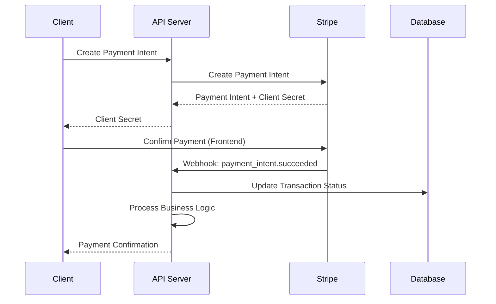

# 💳 Payments Module

The Payments module handles all payment processing through Stripe, including service bookings, subscription management, lead purchases, and service promotions.

## 📋 Overview

- **Status:** ✅ Complete
- **Location:** `apps/api/src/payments/`
- **Dependencies:** Stripe SDK, Prisma, Auth Module, Bookings Module
- **Database Tables:** PaymentMethod, Transaction, Subscription, LeadPurchase

## 🏗️ Architecture

### Components

```
payments/
├── payments.controller.ts  # Payment endpoints
├── payments.service.ts     # Business logic
├── payments.module.ts      # Module configuration
├── stripe.service.ts       # Stripe integration
└── dto/
    ├── create-payment-method.dto.ts  # Payment method validation
    ├── process-payment.dto.ts        # Payment processing
    ├── subscription.dto.ts           # Subscription management
    └── webhook.dto.ts                # Stripe webhook handling
```

### Payment Flow



## 🔑 Features

### Payment Methods
- ✅ Credit/Debit Cards (Visa, Mastercard, Amex)
- ✅ Apple Pay integration
- ✅ Google Pay integration
- ✅ ACH Bank Transfers
- ✅ Payment method storage and reuse
- ✅ Default payment method selection

### Payment Types
- ✅ **Service Bookings** - One-time payments for services
- ✅ **Subscription Payments** - Monthly PRO plan subscriptions
- ✅ **Lead Purchases** - Individual lead purchases for FREE plan users
- ✅ **Service Promotions** - Boost/ADS campaign payments
- ✅ **Platform Fees** - 5% fee on all transactions

### Advanced Features
- ✅ Payment authorization and capture
- ✅ Automatic refund processing
- ✅ Dispute handling
- ✅ Multi-currency support (USD primary)
- ✅ Recurring billing management
- ✅ Payment failure retry logic
- ✅ Comprehensive transaction logging

## 🛠️ API Endpoints

### Payment Method Management

#### Add Payment Method
```http
POST /payments/payment-methods
Authorization: Bearer <access_token>
Content-Type: application/json

{
  "type": "card",
  "card": {
    "number": "4242424242424242",
    "exp_month": 12,
    "exp_year": 2025,
    "cvc": "123"
  },
  "billing_details": {
    "name": "John Doe",
    "address": {
      "line1": "123 Main St",
      "city": "Miami",
      "state": "FL",
      "postal_code": "33101",
      "country": "US"
    }
  }
}
```

#### Get Payment Methods
```http
GET /payments/payment-methods
Authorization: Bearer <access_token>
```

**Response:**
```json
{
  "success": true,
  "paymentMethods": [
    {
      "id": "pm_1234567890",
      "type": "card",
      "card": {
        "brand": "visa",
        "last4": "4242",
        "exp_month": 12,
        "exp_year": 2025
      },
      "billing_details": {
        "name": "John Doe"
      },
      "isDefault": true,
      "createdAt": "2024-01-15T10:00:00Z"
    }
  ]
}
```

#### Set Default Payment Method
```http
PUT /payments/payment-methods/:id/default
Authorization: Bearer <access_token>
```

#### Delete Payment Method
```http
DELETE /payments/payment-methods/:id
Authorization: Bearer <access_token>
```

### Service Booking Payments

#### Create Payment Intent for Booking
```http
POST /payments/booking-payment
Authorization: Bearer <access_token>
Content-Type: application/json

{
  "bookingId": "booking-uuid",
  "paymentMethodId": "pm_1234567890",
  "savePaymentMethod": true
}
```

**Response:**
```json
{
  "success": true,
  "paymentIntent": {
    "id": "pi_1234567890",
    "clientSecret": "pi_1234567890_secret_abcd",
    "amount": 8000,
    "currency": "usd",
    "status": "requires_confirmation"
  },
  "booking": {
    "id": "booking-uuid",
    "totalAmount": 80.00,
    "platformFee": 4.00,
    "providerAmount": 76.00
  }
}
```

#### Confirm Payment
```http
POST /payments/confirm-payment
Authorization: Bearer <access_token>
Content-Type: application/json

{
  "paymentIntentId": "pi_1234567890"
}
```

### Subscription Management

#### Create PRO Subscription
```http
POST /payments/subscriptions
Authorization: Bearer <access_token>
Content-Type: application/json

{
  "planId": "pro-monthly",
  "paymentMethodId": "pm_1234567890",
  "trialDays": 7
}
```

**Response:**
```json
{
  "success": true,
  "subscription": {
    "id": "sub_1234567890",
    "status": "trialing",
    "currentPeriodStart": "2024-01-15T10:00:00Z",
    "currentPeriodEnd": "2024-01-22T10:00:00Z",
    "trialEnd": "2024-01-22T10:00:00Z",
    "plan": {
      "id": "pro-monthly",
      "name": "PRO Plan",
      "amount": 3480,
      "currency": "usd",
      "interval": "month"
    }
  }
}
```

#### Update Subscription
```http
PUT /payments/subscriptions/:id
Authorization: Bearer <access_token>
Content-Type: application/json

{
  "paymentMethodId": "pm_9876543210"
}
```

#### Cancel Subscription
```http
DELETE /payments/subscriptions/:id
Authorization: Bearer <access_token>
Content-Type: application/json

{
  "cancelAtPeriodEnd": true,
  "reason": "No longer needed"
}
```

### Lead Purchases

#### Purchase Individual Lead
```http
POST /payments/leads/purchase
Authorization: Bearer <access_token>
Content-Type: application/json

{
  "quantity": 5,
  "paymentMethodId": "pm_1234567890"
}
```

**Response:**
```json
{
  "success": true,
  "purchase": {
    "id": "lead_purchase_123",
    "quantity": 5,
    "unitPrice": 3.00,
    "totalAmount": 15.00,
    "newLeadLimit": 15,
    "paymentStatus": "succeeded"
  }
}
```

### Service Promotions

#### Boost Service
```http
POST /payments/promotions/boost
Authorization: Bearer <access_token>
Content-Type: application/json

{
  "serviceId": "service-uuid",
  "duration": 7,
  "budget": 50.00,
  "paymentMethodId": "pm_1234567890"
}
```

### Transaction History

#### Get Transaction History
```http
GET /payments/transactions?type=booking&status=succeeded&page=1&limit=10
Authorization: Bearer <access_token>
```

**Response:**
```json
{
  "success": true,
  "transactions": [
    {
      "id": "txn_1234567890",
      "type": "booking",
      "amount": 80.00,
      "currency": "usd",
      "status": "succeeded",
      "description": "Payment for Professional House Cleaning",
      "paymentMethod": {
        "type": "card",
        "last4": "4242"
      },
      "createdAt": "2024-01-15T10:00:00Z"
    }
  ],
  "pagination": {
    "page": 1,
    "limit": 10,
    "total": 45,
    "pages": 5
  }
}
```

### Refunds

#### Process Refund
```http
POST /payments/refunds
Authorization: Bearer <access_token>
Content-Type: application/json

{
  "paymentIntentId": "pi_1234567890",
  "amount": 8000,
  "reason": "requested_by_customer"
}
```

### Webhooks

#### Stripe Webhook Endpoint
```http
POST /payments/webhooks/stripe
Content-Type: application/json
Stripe-Signature: t=1234567890,v1=signature

{
  "type": "payment_intent.succeeded",
  "data": {
    "object": {
      "id": "pi_1234567890",
      "amount": 8000,
      "currency": "usd",
      "status": "succeeded"
    }
  }
}
```

## 📊 Database Schema

### PaymentMethod Table
```sql
CREATE TABLE "PaymentMethod" (
    "id" TEXT NOT NULL,
    "userId" TEXT NOT NULL,
    "stripePaymentMethodId" TEXT NOT NULL,
    "type" TEXT NOT NULL,
    "card" JSONB,
    "billingDetails" JSONB,
    "isDefault" BOOLEAN NOT NULL DEFAULT false,
    "isActive" BOOLEAN NOT NULL DEFAULT true,
    "createdAt" TIMESTAMP(3) NOT NULL DEFAULT CURRENT_TIMESTAMP,
    "updatedAt" TIMESTAMP(3) NOT NULL,
    
    CONSTRAINT "PaymentMethod_pkey" PRIMARY KEY ("id")
);
```

### Transaction Table
```sql
CREATE TABLE "Transaction" (
    "id" TEXT NOT NULL,
    "userId" TEXT NOT NULL,
    "stripePaymentIntentId" TEXT NOT NULL,
    "type" "TransactionType" NOT NULL,
    "amount" DECIMAL(10,2) NOT NULL,
    "currency" TEXT NOT NULL DEFAULT 'usd',
    "status" "TransactionStatus" NOT NULL,
    "description" TEXT,
    "metadata" JSONB,
    "bookingId" TEXT,
    "subscriptionId" TEXT,
    "refundId" TEXT,
    "createdAt" TIMESTAMP(3) NOT NULL DEFAULT CURRENT_TIMESTAMP,
    "updatedAt" TIMESTAMP(3) NOT NULL,
    
    CONSTRAINT "Transaction_pkey" PRIMARY KEY ("id")
);
```

### Subscription Table
```sql
CREATE TABLE "Subscription" (
    "id" TEXT NOT NULL,
    "userId" TEXT NOT NULL,
    "stripeSubscriptionId" TEXT NOT NULL,
    "planId" TEXT NOT NULL,
    "status" "SubscriptionStatus" NOT NULL,
    "currentPeriodStart" TIMESTAMP(3) NOT NULL,
    "currentPeriodEnd" TIMESTAMP(3) NOT NULL,
    "trialEnd" TIMESTAMP(3),
    "cancelAtPeriodEnd" BOOLEAN NOT NULL DEFAULT false,
    "canceledAt" TIMESTAMP(3),
    "createdAt" TIMESTAMP(3) NOT NULL DEFAULT CURRENT_TIMESTAMP,
    "updatedAt" TIMESTAMP(3) NOT NULL,
    
    CONSTRAINT "Subscription_pkey" PRIMARY KEY ("id")
);
```

### LeadPurchase Table
```sql
CREATE TABLE "LeadPurchase" (
    "id" TEXT NOT NULL,
    "userId" TEXT NOT NULL,
    "quantity" INTEGER NOT NULL,
    "unitPrice" DECIMAL(10,2) NOT NULL,
    "totalAmount" DECIMAL(10,2) NOT NULL,
    "stripePaymentIntentId" TEXT NOT NULL,
    "status" "TransactionStatus" NOT NULL,
    "createdAt" TIMESTAMP(3) NOT NULL DEFAULT CURRENT_TIMESTAMP,
    "updatedAt" TIMESTAMP(3) NOT NULL,
    
    CONSTRAINT "LeadPurchase_pkey" PRIMARY KEY ("id")
);
```

## 🎯 Usage Examples

### Frontend Payment Integration

```typescript
// React Stripe integration
import { loadStripe } from '@stripe/stripe-js';
import { Elements, CardElement, useStripe, useElements } from '@stripe/react-stripe-js';

const stripePromise = loadStripe(process.env.NEXT_PUBLIC_STRIPE_PUBLISHABLE_KEY!);

function PaymentForm({ booking }: { booking: Booking }) {
  const stripe = useStripe();
  const elements = useElements();
  const [paymentMethods, setPaymentMethods] = useState<PaymentMethod[]>([]);
  const [selectedPaymentMethod, setSelectedPaymentMethod] = useState<string>('');

  const { data: methods } = useQuery({
    queryKey: ['payment-methods'],
    queryFn: getPaymentMethods
  });

  const processPaymentMutation = useMutation({
    mutationFn: processBookingPayment,
    onSuccess: (result) => {
      if (result.paymentIntent.status === 'succeeded') {
        toast.success('Payment successful!');
        navigate(`/bookings/${booking.id}`);
      }
    },
    onError: (error) => {
      toast.error('Payment failed. Please try again.');
    }
  });

  const handleSubmit = async (e: React.FormEvent) => {
    e.preventDefault();
    
    if (!stripe || !elements) return;

    if (selectedPaymentMethod) {
      // Use existing payment method
      processPaymentMutation.mutate({
        bookingId: booking.id,
        paymentMethodId: selectedPaymentMethod
      });
    } else {
      // Create new payment method
      const cardElement = elements.getElement(CardElement);
      if (!cardElement) return;

      const { error, paymentMethod } = await stripe.createPaymentMethod({
        type: 'card',
        card: cardElement,
      });

      if (error) {
        toast.error(error.message);
        return;
      }

      processPaymentMutation.mutate({
        bookingId: booking.id,
        paymentMethodId: paymentMethod.id,
        savePaymentMethod: true
      });
    }
  };

  return (
    <form onSubmit={handleSubmit}>
      <div className="booking-summary">
        <h3>Payment Summary</h3>
        <p>Service: {booking.service.title}</p>
        <p>Amount: ${booking.totalAmount}</p>
        <p>Platform Fee: ${booking.platformFee}</p>
        <p><strong>Total: ${booking.totalAmount}</strong></p>
      </div>

      <div className="payment-methods">
        <h4>Payment Method</h4>
        
        {methods?.map(method => (
          <div key={method.id} className="payment-method-option">
            <input
              type="radio"
              id={method.id}
              name="paymentMethod"
              value={method.id}
              checked={selectedPaymentMethod === method.id}
              onChange={(e) => setSelectedPaymentMethod(e.target.value)}
            />
            <label htmlFor={method.id}>
              **** **** **** {method.card.last4} ({method.card.brand})
            </label>
          </div>
        ))}

        <div className="payment-method-option">
          <input
            type="radio"
            id="new-card"
            name="paymentMethod"
            value=""
            checked={selectedPaymentMethod === ''}
            onChange={() => setSelectedPaymentMethod('')}
          />
          <label htmlFor="new-card">Add new card</label>
        </div>
      </div>

      {selectedPaymentMethod === '' && (
        <div className="card-element">
          <CardElement
            options={{
              style: {
                base: {
                  fontSize: '16px',
                  color: '#424770',
                  '::placeholder': {
                    color: '#aab7c4',
                  },
                },
              },
            }}
          />
        </div>
      )}

      <button 
        type="submit" 
        disabled={!stripe || processPaymentMutation.isLoading}
      >
        {processPaymentMutation.isLoading ? 'Processing...' : `Pay $${booking.totalAmount}`}
      </button>
    </form>
  );
}

// Wrap with Stripe Elements
function PaymentPage({ booking }: { booking: Booking }) {
  return (
    <Elements stripe={stripePromise}>
      <PaymentForm booking={booking} />
    </Elements>
  );
}
```

### Subscription Management

```typescript
// Subscription management component
function SubscriptionManager() {
  const { data: subscription } = useQuery({
    queryKey: ['subscription'],
    queryFn: getCurrentSubscription
  });

  const createSubscriptionMutation = useMutation({
    mutationFn: createSubscription,
    onSuccess: () => {
      queryClient.invalidateQueries(['subscription']);
      toast.success('Subscription created successfully!');
    }
  });

  const cancelSubscriptionMutation = useMutation({
    mutationFn: cancelSubscription,
    onSuccess: () => {
      queryClient.invalidateQueries(['subscription']);
      toast.success('Subscription cancelled successfully');
    }
  });

  const handleUpgrade = () => {
    createSubscriptionMutation.mutate({
      planId: 'pro-monthly',
      paymentMethodId: defaultPaymentMethod.id,
      trialDays: 7
    });
  };

  const handleCancel = () => {
    if (subscription) {
      cancelSubscriptionMutation.mutate({
        subscriptionId: subscription.id,
        cancelAtPeriodEnd: true
      });
    }
  };

  if (!subscription) {
    return (
      <div className="subscription-upgrade">
        <h3>Upgrade to PRO</h3>
        <div className="plan-benefits">
          <ul>
            <li>Unlimited leads and messages</li>
            <li>Verified badge</li>
            <li>Top search visibility</li>
            <li>Analytics dashboard</li>
            <li>ADS/boost access</li>
            <li>Priority support</li>
          </ul>
        </div>
        <div className="pricing">
          <p>$34.80/month</p>
          <p>7-day free trial</p>
        </div>
        <button onClick={handleUpgrade}>Start Free Trial</button>
      </div>
    );
  }

  return (
    <div className="subscription-status">
      <h3>Current Subscription</h3>
      <div className="subscription-details">
        <p><strong>Plan:</strong> {subscription.plan.name}</p>
        <p><strong>Status:</strong> {subscription.status}</p>
        <p><strong>Current Period:</strong> {formatDate(subscription.currentPeriodStart)} - {formatDate(subscription.currentPeriodEnd)}</p>
        {subscription.trialEnd && (
          <p><strong>Trial Ends:</strong> {formatDate(subscription.trialEnd)}</p>
        )}
        {subscription.cancelAtPeriodEnd && (
          <p className="warning">Subscription will cancel at period end</p>
        )}
      </div>
      
      <div className="subscription-actions">
        <button onClick={handleCancel}>Cancel Subscription</button>
        <button onClick={() => navigate('/payment-methods')}>Update Payment Method</button>
      </div>
    </div>
  );
}
```

## 🔒 Security & Compliance

### PCI Compliance
- All card data handled by Stripe (PCI DSS Level 1)
- No sensitive card data stored on our servers
- Secure tokenization for payment methods
- Regular security audits and monitoring

### Fraud Prevention
- Stripe Radar for fraud detection
- 3D Secure authentication when required
- Velocity checks for unusual activity
- Manual review for high-risk transactions

### Data Protection
- Encrypted data transmission (TLS 1.2+)
- Secure webhook signature verification
- Payment method tokenization
- GDPR compliance for EU customers

## 🧪 Testing

### Unit Tests
```typescript
describe('PaymentsService', () => {
  it('should create payment intent for booking', async () => {
    const booking = await createTestBooking();
    
    const paymentIntent = await service.createBookingPaymentIntent(
      booking.id,
      'pm_test_card'
    );
    
    expect(paymentIntent.amount).toBe(8000); // $80.00
    expect(paymentIntent.currency).toBe('usd');
    expect(paymentIntent.status).toBe('requires_confirmation');
  });

  it('should process refund correctly', async () => {
    const payment = await createTestPayment();
    
    const refund = await service.processRefund(
      payment.stripePaymentIntentId,
      8000,
      'requested_by_customer'
    );
    
    expect(refund.amount).toBe(8000);
    expect(refund.status).toBe('succeeded');
  });
});
```

### Integration Tests
```typescript
describe('Payments API', () => {
  it('should process booking payment end-to-end', async () => {
    const booking = await createTestBooking();
    
    const response = await request(app.getHttpServer())
      .post('/payments/booking-payment')
      .set('Authorization', `Bearer ${clientToken}`)
      .send({
        bookingId: booking.id,
        paymentMethodId: 'pm_card_visa'
      })
      .expect(201);

    expect(response.body.success).toBe(true);
    expect(response.body.paymentIntent.amount).toBe(8000);
  });
});
```

## 🔧 Configuration

### Environment Variables
```env
# Stripe Configuration
STRIPE_SECRET_KEY=sk_test_...
STRIPE_PUBLISHABLE_KEY=pk_test_...
STRIPE_WEBHOOK_SECRET=whsec_...

# Payment Settings
PLATFORM_FEE_PERCENTAGE=5.0
CURRENCY=usd
PAYMENT_DESCRIPTION_PREFIX=Fixelo -

# Plan Configuration
PRO_PLAN_PRICE=3480  # $34.80
PRO_PLAN_TRIAL_DAYS=7
LEAD_PURCHASE_PRICE=300  # $3.00

# Refund Settings
AUTO_REFUND_ENABLED=true
REFUND_PROCESSING_DELAY_HOURS=24
```

### Stripe Webhook Configuration
```typescript
// Webhook events to listen for
const WEBHOOK_EVENTS = [
  'payment_intent.succeeded',
  'payment_intent.payment_failed',
  'payment_method.attached',
  'invoice.payment_succeeded',
  'invoice.payment_failed',
  'customer.subscription.created',
  'customer.subscription.updated',
  'customer.subscription.deleted',
];
```

## 📚 Related Documentation

- [Bookings Module](./bookings.md)
- [User Management](./users.md)
- [ADS System](./ads.md)
- [Stripe Integration Guide](../guides/stripe-integration.md)

## 🐛 Troubleshooting

### Common Issues

1. **Payment Intent Creation Fails**
   - Check Stripe API keys
   - Verify customer exists in Stripe
   - Ensure amount is valid (>= $0.50)

2. **Webhook Signature Verification Fails**
   - Verify webhook secret
   - Check request headers
   - Ensure proper endpoint URL

3. **Subscription Creation Issues**
   - Verify payment method is attached
   - Check plan ID exists
   - Ensure customer has valid payment method

### Debug Commands
```bash
# Test Stripe connection
npm run stripe:test

# View webhook events
npm run stripe:webhooks

# Check payment logs
npm run logs:payments
``` 