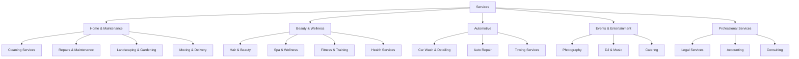

# 🛍️ Services Module

The Services module manages the service marketplace, including service creation, search, categorization, and provider management with 120+ service categories.

## 📋 Overview

- **Status:** ✅ Complete
- **Location:** `apps/api/src/services/`
- **Dependencies:** Prisma, class-validator, Auth Module, Users Module
- **Database Tables:** Service, ServiceCategory, ServiceImage

## 🏗️ Architecture

### Components

```
services/
├── services.controller.ts  # Service endpoints
├── services.service.ts     # Business logic
├── services.module.ts      # Module configuration
└── dto/
    ├── create-service.dto.ts    # Service creation validation
    ├── update-service.dto.ts    # Service update validation
    ├── service-filter.dto.ts    # Search and filter validation
    └── service-response.dto.ts  # Response formatting
```

### Service Categories (120+)



## 🔑 Features

### Service Management
- ✅ Create, read, update, delete services
- ✅ 120+ predefined service categories
- ✅ Multiple service images upload
- ✅ Pricing and package management
- ✅ Service availability and scheduling
- ✅ Geographic service area definition

### Advanced Search & Filtering
- ✅ Text search across title and description
- ✅ Category-based filtering
- ✅ Location-based search with radius
- ✅ Price range filtering
- ✅ Provider rating filtering
- ✅ Availability filtering
- ✅ Sort by price, rating, distance, date

### Provider Features
- ✅ Service portfolio management
- ✅ Plan-based service limits (FREE: 5 services, PRO: unlimited)
- ✅ Service boost/promotion integration
- ✅ Performance analytics
- ✅ Lead generation tracking

### Client Features
- ✅ Browse services by category
- ✅ Location-based recommendations
- ✅ Service comparison
- ✅ Favorite services
- ✅ Service booking integration

## 🛠️ API Endpoints

### Service CRUD Endpoints

#### Create Service
```http
POST /services
Authorization: Bearer <access_token>
Content-Type: application/json

{
  "title": "Professional House Cleaning",
  "description": "Deep cleaning service for residential properties",
  "category": "HOUSE_CLEANING",
  "price": 80.00,
  "duration": 120,
  "serviceArea": ["Miami", "Fort Lauderdale"],
  "isActive": true,
  "images": [
    "https://example.com/image1.jpg",
    "https://example.com/image2.jpg"
  ]
}
```

#### Get All Services
```http
GET /services?category=CLEANING&city=Miami&minPrice=50&maxPrice=200&page=1&limit=10
```

**Response:**
```json
{
  "success": true,
  "data": [
    {
      "id": "service-uuid",
      "title": "Professional House Cleaning",
      "description": "Deep cleaning service for residential properties",
      "category": "HOUSE_CLEANING",
      "price": 80.00,
      "duration": 120,
      "rating": 4.8,
      "reviewCount": 25,
      "provider": {
        "id": "provider-uuid",
        "firstName": "Jane",
        "lastName": "Smith",
        "businessName": "Smith Cleaning Services",
        "verified": true,
        "rating": 4.9
      },
      "images": [
        "https://example.com/image1.jpg"
      ],
      "location": {
        "city": "Miami",
        "state": "FL"
      },
      "createdAt": "2024-01-15T10:00:00Z"
    }
  ],
  "pagination": {
    "page": 1,
    "limit": 10,
    "total": 156,
    "pages": 16
  }
}
```

#### Get Service by ID
```http
GET /services/:id
```

#### Update Service
```http
PUT /services/:id
Authorization: Bearer <access_token>
Content-Type: application/json

{
  "title": "Updated Service Title",
  "price": 90.00,
  "description": "Updated description"
}
```

#### Delete Service
```http
DELETE /services/:id
Authorization: Bearer <access_token>
```

### Search & Filter Endpoints

#### Search Services
```http
GET /services/search?q=cleaning&category=CLEANING&city=Miami&radius=25&minPrice=50&maxPrice=200&sortBy=price&sortOrder=asc
```

#### Get Services by Category
```http
GET /services/category/:category?city=Miami&page=1&limit=10
```

#### Get Services by Provider
```http
GET /services/provider/:providerId
```

#### Get Nearby Services
```http
GET /services/nearby?lat=25.7617&lng=-80.1918&radius=10&category=CLEANING
```

### Provider-Specific Endpoints

#### Get My Services
```http
GET /services/my-services
Authorization: Bearer <access_token>
```

#### Get Service Statistics
```http
GET /services/:id/stats
Authorization: Bearer <access_token>
```

**Response:**
```json
{
  "success": true,
  "stats": {
    "views": 156,
    "inquiries": 23,
    "bookings": 18,
    "conversionRate": 0.78,
    "revenue": 1440.00,
    "averageRating": 4.8
  }
}
```

#### Boost Service (PRO only)
```http
POST /services/:id/boost
Authorization: Bearer <access_token>
Content-Type: application/json

{
  "duration": 7,
  "budget": 50.00
}
```

## 📊 Database Schema

### Service Table
```sql
CREATE TABLE "Service" (
    "id" TEXT NOT NULL,
    "title" TEXT NOT NULL,
    "description" TEXT NOT NULL,
    "category" "ServiceCategory" NOT NULL,
    "price" DECIMAL(10,2) NOT NULL,
    "priceType" "PriceType" NOT NULL DEFAULT 'FIXED',
    "duration" INTEGER,
    "providerId" TEXT NOT NULL,
    "isActive" BOOLEAN NOT NULL DEFAULT true,
    "serviceArea" TEXT[],
    "city" TEXT NOT NULL,
    "state" TEXT NOT NULL,
    "latitude" DECIMAL(10,8),
    "longitude" DECIMAL(11,8),
    "rating" DECIMAL(3,2) DEFAULT 0,
    "reviewCount" INTEGER DEFAULT 0,
    "bookingCount" INTEGER DEFAULT 0,
    "viewCount" INTEGER DEFAULT 0,
    "isFeatured" BOOLEAN DEFAULT false,
    "featuredUntil" TIMESTAMP(3),
    "createdAt" TIMESTAMP(3) NOT NULL DEFAULT CURRENT_TIMESTAMP,
    "updatedAt" TIMESTAMP(3) NOT NULL,
    
    CONSTRAINT "Service_pkey" PRIMARY KEY ("id")
);
```

### ServiceImage Table
```sql
CREATE TABLE "ServiceImage" (
    "id" TEXT NOT NULL,
    "serviceId" TEXT NOT NULL,
    "url" TEXT NOT NULL,
    "alt" TEXT,
    "order" INTEGER NOT NULL DEFAULT 0,
    "createdAt" TIMESTAMP(3) NOT NULL DEFAULT CURRENT_TIMESTAMP,
    
    CONSTRAINT "ServiceImage_pkey" PRIMARY KEY ("id")
);
```

### Service Categories Enum
```typescript
export enum ServiceCategory {
  // Home & Maintenance
  HOUSE_CLEANING = 'HOUSE_CLEANING',
  OFFICE_CLEANING = 'OFFICE_CLEANING',
  DEEP_CLEANING = 'DEEP_CLEANING',
  CARPET_CLEANING = 'CARPET_CLEANING',
  WINDOW_CLEANING = 'WINDOW_CLEANING',
  PRESSURE_WASHING = 'PRESSURE_WASHING',
  PLUMBING = 'PLUMBING',
  ELECTRICAL = 'ELECTRICAL',
  HVAC = 'HVAC',
  HANDYMAN = 'HANDYMAN',
  PAINTING = 'PAINTING',
  LANDSCAPING = 'LANDSCAPING',
  LAWN_CARE = 'LAWN_CARE',
  TREE_SERVICE = 'TREE_SERVICE',
  POOL_CLEANING = 'POOL_CLEANING',
  PEST_CONTROL = 'PEST_CONTROL',
  
  // Beauty & Wellness
  HAIR_STYLING = 'HAIR_STYLING',
  HAIR_COLORING = 'HAIR_COLORING',
  BARBERING = 'BARBERING',
  NAIL_CARE = 'NAIL_CARE',
  MASSAGE = 'MASSAGE',
  FACIAL = 'FACIAL',
  MAKEUP = 'MAKEUP',
  PERSONAL_TRAINING = 'PERSONAL_TRAINING',
  YOGA = 'YOGA',
  NUTRITION = 'NUTRITION',
  
  // Automotive
  CAR_WASH = 'CAR_WASH',
  CAR_DETAILING = 'CAR_DETAILING',
  AUTO_REPAIR = 'AUTO_REPAIR',
  TIRE_SERVICE = 'TIRE_SERVICE',
  TOWING = 'TOWING',
  
  // Events & Entertainment
  PHOTOGRAPHY = 'PHOTOGRAPHY',
  VIDEOGRAPHY = 'VIDEOGRAPHY',
  DJ_SERVICES = 'DJ_SERVICES',
  LIVE_MUSIC = 'LIVE_MUSIC',
  CATERING = 'CATERING',
  EVENT_PLANNING = 'EVENT_PLANNING',
  
  // Professional Services
  LEGAL_SERVICES = 'LEGAL_SERVICES',
  ACCOUNTING = 'ACCOUNTING',
  CONSULTING = 'CONSULTING',
  TUTORING = 'TUTORING',
  TRANSLATION = 'TRANSLATION',
  
  // Pet Services
  PET_GROOMING = 'PET_GROOMING',
  PET_SITTING = 'PET_SITTING',
  DOG_WALKING = 'DOG_WALKING',
  VETERINARY = 'VETERINARY',
  
  // Moving & Delivery
  MOVING_SERVICES = 'MOVING_SERVICES',
  DELIVERY = 'DELIVERY',
  FURNITURE_ASSEMBLY = 'FURNITURE_ASSEMBLY',
  
  // And 80+ more categories...
}
```

## 🎯 Usage Examples

### Creating a Service (Provider)

```typescript
// React component for service creation
import { useMutation } from '@tanstack/react-query';
import { createService } from '../api/services';

function CreateServiceForm() {
  const createServiceMutation = useMutation({
    mutationFn: createService,
    onSuccess: () => {
      toast.success('Service created successfully');
      navigate('/provider/services');
    },
    onError: (error) => {
      toast.error('Failed to create service');
    }
  });

  const handleSubmit = (formData: CreateServiceDto) => {
    createServiceMutation.mutate(formData);
  };

  return (
    <form onSubmit={handleSubmit}>
      <input
        type="text"
        placeholder="Service Title"
        required
      />
      <textarea
        placeholder="Service Description"
        required
      />
      <select name="category" required>
        <option value="">Select Category</option>
        <option value="HOUSE_CLEANING">House Cleaning</option>
        <option value="PLUMBING">Plumbing</option>
        {/* ... more categories */}
      </select>
      <input
        type="number"
        placeholder="Price"
        step="0.01"
        required
      />
      <button type="submit">Create Service</button>
    </form>
  );
}
```

### Searching Services (Client)

```typescript
// Service search component
import { useQuery } from '@tanstack/react-query';
import { searchServices } from '../api/services';

function ServiceSearch() {
  const [filters, setFilters] = useState({
    category: '',
    city: 'Miami',
    minPrice: 0,
    maxPrice: 1000,
    sortBy: 'rating',
    sortOrder: 'desc'
  });

  const { data: services, isLoading } = useQuery({
    queryKey: ['services', filters],
    queryFn: () => searchServices(filters)
  });

  return (
    <div className="service-search">
      <div className="filters">
        <select 
          value={filters.category} 
          onChange={(e) => setFilters({...filters, category: e.target.value})}
        >
          <option value="">All Categories</option>
          <option value="CLEANING">Cleaning</option>
          <option value="REPAIRS">Repairs</option>
        </select>
        
        <input
          type="range"
          min="0"
          max="1000"
          value={filters.maxPrice}
          onChange={(e) => setFilters({...filters, maxPrice: Number(e.target.value)})}
        />
      </div>

      <div className="results">
        {isLoading ? (
          <div>Loading services...</div>
        ) : (
          services?.data.map(service => (
            <ServiceCard key={service.id} service={service} />
          ))
        )}
      </div>
    </div>
  );
}
```

### Service Card Component

```typescript
function ServiceCard({ service }: { service: Service }) {
  return (
    <div className="service-card">
      <div className="service-image">
        
        {service.isFeatured && <span className="featured-badge">Featured</span>}
      </div>
      
      <div className="service-info">
        <h3>{service.title}</h3>
        <p className="description">{service.description}</p>
        
        <div className="provider-info">
          <span>{service.provider.businessName}</span>
          {service.provider.verified && <VerifiedBadge />}
        </div>
        
        <div className="service-meta">
          <span className="price">${service.price}</span>
          <span className="rating">
            ⭐ {service.rating} ({service.reviewCount})
          </span>
          <span className="location">{service.city}, {service.state}</span>
        </div>
        
        <div className="actions">
          <button onClick={() => bookService(service.id)}>
            Book Now
          </button>
          <button onClick={() => contactProvider(service.providerId)}>
            Contact
          </button>
        </div>
      </div>
    </div>
  );
}
```

## 🔒 Security & Business Rules

### Provider Limitations
- **FREE Plan:** Maximum 5 active services
- **PRO Plan:** Unlimited services
- Service creation requires verified provider account
- Service editing only by service owner or admin

### Service Validation
- Title: 10-100 characters
- Description: 50-2000 characters
- Price: Must be positive number
- Category: Must be valid enum value
- Service area: Must be within Florida

### Geographic Restrictions
- All services must be located in Florida, USA
- Service area validation against Florida cities
- Geolocation coordinates validation

## 🧪 Testing

### Unit Tests
```typescript
describe('ServicesService', () => {
  it('should create service for PRO provider', async () => {
    const createDto = {
      title: 'Test Service',
      description: 'Test description',
      category: ServiceCategory.HOUSE_CLEANING,
      price: 100.00,
      city: 'Miami',
      state: 'FL'
    };

    const result = await service.create(proProviderId, createDto);
    
    expect(result.title).toBe(createDto.title);
    expect(result.providerId).toBe(proProviderId);
  });

  it('should reject service creation for FREE provider at limit', async () => {
    // Create 5 services for FREE provider
    for (let i = 0; i < 5; i++) {
      await service.create(freeProviderId, createServiceDto);
    }

    // 6th service should fail
    await expect(
      service.create(freeProviderId, createServiceDto)
    ).rejects.toThrow('Service limit exceeded');
  });
});
```

### Integration Tests
```typescript
describe('Services API', () => {
  it('should search services by category', async () => {
    const response = await request(app.getHttpServer())
      .get('/services?category=CLEANING&city=Miami')
      .expect(200);

    expect(response.body.success).toBe(true);
    expect(response.body.data).toBeInstanceOf(Array);
  });
});
```

## 🔧 Configuration

### Environment Variables
```env
# Service settings
MAX_SERVICES_FREE=5
MAX_SERVICES_PRO=unlimited
SERVICE_IMAGE_MAX_SIZE=5242880  # 5MB
SERVICE_IMAGE_MAX_COUNT=10

# Geographic settings
DEFAULT_STATE=FL
DEFAULT_COUNTRY=US
SEARCH_RADIUS_DEFAULT=25  # miles
SEARCH_RADIUS_MAX=100

# Featured services
FEATURED_SERVICE_PRICE=10.00  # per day
FEATURED_SERVICE_MAX_DURATION=30  # days
```

### Module Configuration
```typescript
@Module({
  imports: [
    PrismaModule,
    AuthModule,
    UsersModule,
    MulterModule.register({
      dest: './uploads/services',
      limits: {
        fileSize: 5 * 1024 * 1024, // 5MB
        files: 10,
      },
    }),
  ],
  controllers: [ServicesController],
  providers: [ServicesService],
  exports: [ServicesService],
})
export class ServicesModule {}
```

## 📚 Related Documentation

- [Bookings Module](./bookings.md)
- [Payments Module](./payments.md)
- [ADS System](./ads.md)
- [User Management](./users.md)
- [Geographic Search Guide](../guides/geographic-search.md)

## 🐛 Troubleshooting

### Common Issues

1. **Service Creation Fails**
   - Check provider plan limits
   - Verify required fields
   - Ensure valid category selection

2. **Search Returns No Results**
   - Verify geographic filters
   - Check category spelling
   - Ensure services exist in area

3. **Image Upload Issues**
   - Check file size limits
   - Verify supported formats
   - Ensure proper authentication

### Debug Commands
```bash
# Check service data
npm run prisma:studio

# Seed service categories
npx prisma db seed -- --services

# Reset service data
npm run db:reset -- --services-only
``` 