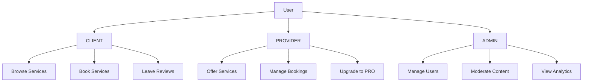

# 👥 User Management Module

The User Management module handles user profiles, account management, and user-related operations for all user types (clients, providers, and admins).

## 📋 Overview

- **Status:** ✅ Complete
- **Location:** `apps/api/src/users/`
- **Dependencies:** Prisma, class-validator, Auth Module
- **Database Tables:** User, UserProfile, ProviderProfile

## 🏗️ Architecture

### Components

```
users/
├── users.controller.ts     # User endpoints
├── users.service.ts        # Business logic
├── users.module.ts        # Module configuration
└── dto/
    ├── create-user.dto.ts  # User creation validation
    ├── update-user.dto.ts  # User update validation
    └── user-response.dto.ts # Response formatting
```

### User Roles



## 🔑 Features

### User Profile Management
- ✅ Complete user profiles with personal information
- ✅ Profile picture upload and management
- ✅ Contact information (phone, address, social media)
- ✅ Account settings and preferences
- ✅ Privacy settings
- ✅ Account deactivation/deletion

### Provider-Specific Features
- ✅ Business profile creation
- ✅ Service portfolio management
- ✅ Professional verification
- ✅ Business hours and availability
- ✅ Service area configuration
- ✅ Pricing and package management

### Client-Specific Features
- ✅ Service history and favorites
- ✅ Booking preferences
- ✅ Payment methods management
- ✅ Communication preferences
- ✅ Location and address book

### Admin Features
- ✅ User account management
- ✅ Role assignment and permissions
- ✅ Account verification and approval
- ✅ Content moderation
- ✅ System analytics and reports

## 🛠️ API Endpoints

### User Profile Endpoints

#### Get Current User Profile
```http
GET /users/profile
Authorization: Bearer <access_token>
```

**Response:**
```json
{
  "success": true,
  "user": {
    "id": "uuid",
    "email": "user@example.com",
    "firstName": "John",
    "lastName": "Doe",
    "role": "CLIENT",
    "profile": {
      "phone": "+1234567890",
      "avatar": "https://example.com/avatar.jpg",
      "bio": "Professional service provider",
      "location": {
        "city": "Miami",
        "state": "FL",
        "zipCode": "33101"
      }
    }
  }
}
```

#### Update User Profile
```http
PUT /users/profile
Authorization: Bearer <access_token>
Content-Type: application/json

{
  "firstName": "John",
  "lastName": "Doe",
  "phone": "+1234567890",
  "bio": "Updated bio",
  "location": {
    "city": "Miami",
    "state": "FL",
    "zipCode": "33101"
  }
}
```

#### Upload Profile Picture
```http
POST /users/profile/avatar
Authorization: Bearer <access_token>
Content-Type: multipart/form-data

{
  "avatar": <file>
}
```

### Provider Profile Endpoints

#### Get Provider Profile
```http
GET /users/provider/:id
```

**Response:**
```json
{
  "success": true,
  "provider": {
    "id": "uuid",
    "firstName": "Jane",
    "lastName": "Smith",
    "businessName": "Smith Cleaning Services",
    "verified": true,
    "rating": 4.8,
    "reviewCount": 156,
    "services": [
      {
        "id": "service-uuid",
        "title": "House Cleaning",
        "category": "CLEANING",
        "price": 80.00
      }
    ],
    "profile": {
      "bio": "Professional cleaning service with 10 years experience",
      "businessHours": {
        "monday": "09:00-17:00",
        "tuesday": "09:00-17:00"
      },
      "serviceArea": ["Miami", "Fort Lauderdale"]
    }
  }
}
```

#### Update Provider Profile
```http
PUT /users/provider/profile
Authorization: Bearer <access_token>
Content-Type: application/json

{
  "businessName": "Smith Cleaning Services",
  "bio": "Professional cleaning service",
  "businessHours": {
    "monday": "09:00-17:00",
    "tuesday": "09:00-17:00"
  },
  "serviceArea": ["Miami", "Fort Lauderdale"],
  "certifications": ["Licensed", "Insured"]
}
```

### User Management Endpoints

#### Get All Users (Admin Only)
```http
GET /users
Authorization: Bearer <access_token>
```

#### Get User by ID (Admin Only)
```http
GET /users/:id
Authorization: Bearer <access_token>
```

#### Update User Role (Admin Only)
```http
PUT /users/:id/role
Authorization: Bearer <access_token>
Content-Type: application/json

{
  "role": "PROVIDER"
}
```

#### Deactivate User (Admin Only)
```http
PUT /users/:id/deactivate
Authorization: Bearer <access_token>
```

#### Search Users
```http
GET /users/search?query=john&role=CLIENT&city=Miami
Authorization: Bearer <access_token>
```

## 📊 Database Schema

### User Table
```sql
CREATE TABLE "User" (
    "id" TEXT NOT NULL,
    "email" TEXT NOT NULL,
    "password" TEXT NOT NULL,
    "firstName" TEXT NOT NULL,
    "lastName" TEXT NOT NULL,
    "role" "UserRole" NOT NULL DEFAULT 'CLIENT',
    "isActive" BOOLEAN NOT NULL DEFAULT true,
    "emailVerified" BOOLEAN NOT NULL DEFAULT false,
    "phone" TEXT,
    "avatar" TEXT,
    "createdAt" TIMESTAMP(3) NOT NULL DEFAULT CURRENT_TIMESTAMP,
    "updatedAt" TIMESTAMP(3) NOT NULL,
    
    CONSTRAINT "User_pkey" PRIMARY KEY ("id")
);
```

### UserProfile Table
```sql
CREATE TABLE "UserProfile" (
    "id" TEXT NOT NULL,
    "userId" TEXT NOT NULL,
    "bio" TEXT,
    "dateOfBirth" TIMESTAMP(3),
    "gender" TEXT,
    "language" TEXT NOT NULL DEFAULT 'en',
    "timezone" TEXT,
    "city" TEXT,
    "state" TEXT,
    "zipCode" TEXT,
    "country" TEXT DEFAULT 'US',
    "socialLinks" JSONB,
    "preferences" JSONB,
    "createdAt" TIMESTAMP(3) NOT NULL DEFAULT CURRENT_TIMESTAMP,
    "updatedAt" TIMESTAMP(3) NOT NULL,
    
    CONSTRAINT "UserProfile_pkey" PRIMARY KEY ("id")
);
```

### ProviderProfile Table
```sql
CREATE TABLE "ProviderProfile" (
    "id" TEXT NOT NULL,
    "userId" TEXT NOT NULL,
    "businessName" TEXT,
    "businessType" TEXT,
    "licenseNumber" TEXT,
    "insuranceNumber" TEXT,
    "verified" BOOLEAN NOT NULL DEFAULT false,
    "verificationDate" TIMESTAMP(3),
    "businessHours" JSONB,
    "serviceArea" TEXT[],
    "certifications" TEXT[],
    "yearsOfExperience" INTEGER,
    "employeeCount" INTEGER,
    "planType" "PlanType" NOT NULL DEFAULT 'FREE',
    "planExpiresAt" TIMESTAMP(3),
    "leadCount" INTEGER NOT NULL DEFAULT 0,
    "leadLimit" INTEGER NOT NULL DEFAULT 10,
    "createdAt" TIMESTAMP(3) NOT NULL DEFAULT CURRENT_TIMESTAMP,
    "updatedAt" TIMESTAMP(3) NOT NULL,
    
    CONSTRAINT "ProviderProfile_pkey" PRIMARY KEY ("id")
);
```

## 🎯 Usage Examples

### Getting User Profile in Frontend

```typescript
// React component example
import { useQuery } from '@tanstack/react-query';
import { getUserProfile } from '../api/users';

function UserProfile() {
  const { data: user, isLoading, error } = useQuery({
    queryKey: ['user-profile'],
    queryFn: getUserProfile
  });

  if (isLoading) return <div>Loading...</div>;
  if (error) return <div>Error loading profile</div>;

  return (
    <div className="profile-card">
      
      <h2>{user.firstName} {user.lastName}</h2>
      <p>{user.profile.bio}</p>
      <p>{user.profile.location.city}, {user.profile.location.state}</p>
    </div>
  );
}
```

### Updating User Profile

```typescript
// Profile update function
async function updateProfile(profileData: UpdateProfileDto) {
  const response = await fetch('/api/users/profile', {
    method: 'PUT',
    headers: {
      'Content-Type': 'application/json',
      'Authorization': `Bearer ${getAccessToken()}`
    },
    body: JSON.stringify(profileData)
  });

  if (!response.ok) {
    throw new Error('Failed to update profile');
  }

  return response.json();
}

// Usage in component
const updateProfileMutation = useMutation({
  mutationFn: updateProfile,
  onSuccess: () => {
    queryClient.invalidateQueries(['user-profile']);
    toast.success('Profile updated successfully');
  },
  onError: (error) => {
    toast.error('Failed to update profile');
  }
});
```

### Provider Profile Management

```typescript
// Provider profile component
function ProviderProfile({ providerId }: { providerId: string }) {
  const { data: provider } = useQuery({
    queryKey: ['provider', providerId],
    queryFn: () => getProviderProfile(providerId)
  });

  return (
    <div className="provider-profile">
      <div className="header">
        <h1>{provider.businessName}</h1>
        {provider.verified && <VerifiedBadge />}
        <Rating value={provider.rating} count={provider.reviewCount} />
      </div>
      
      <div className="bio">
        <p>{provider.profile.bio}</p>
      </div>
      
      <div className="services">
        <h3>Services Offered</h3>
        {provider.services.map(service => (
          <ServiceCard key={service.id} service={service} />
        ))}
      </div>
      
      <div className="business-hours">
        <h3>Business Hours</h3>
        <BusinessHours hours={provider.profile.businessHours} />
      </div>
    </div>
  );
}
```

## 🔒 Security & Permissions

### Role-Based Access Control

```typescript
// Controller with role protection
@Controller('users')
@UseGuards(JwtAuthGuard)
export class UsersController {
  @Get()
  @Roles(UserRole.ADMIN)
  @UseGuards(RolesGuard)
  async getAllUsers() {
    // Only admins can access
  }

  @Get('profile')
  async getProfile(@CurrentUser() user: User) {
    // User can only access their own profile
  }

  @Put(':id/role')
  @Roles(UserRole.ADMIN)
  @UseGuards(RolesGuard)
  async updateUserRole(@Param('id') id: string, @Body() dto: UpdateRoleDto) {
    // Only admins can change user roles
  }
}
```

### Data Privacy
- Users can only access their own profile data
- Admins have full access for moderation
- Providers can view limited client information
- Sensitive data is filtered in responses

## 🧪 Testing

### Unit Tests
```typescript
describe('UsersService', () => {
  it('should create user profile', async () => {
    const createDto = {
      firstName: 'John',
      lastName: 'Doe',
      bio: 'Test bio',
      phone: '+1234567890'
    };

    const result = await service.createProfile(userId, createDto);
    
    expect(result.firstName).toBe(createDto.firstName);
    expect(result.lastName).toBe(createDto.lastName);
  });

  it('should update provider profile', async () => {
    const updateDto = {
      businessName: 'New Business Name',
      serviceArea: ['Miami', 'Tampa']
    };

    const result = await service.updateProviderProfile(userId, updateDto);
    
    expect(result.businessName).toBe(updateDto.businessName);
    expect(result.serviceArea).toEqual(updateDto.serviceArea);
  });
});
```

### Integration Tests
```typescript
describe('Users API', () => {
  it('should get user profile', async () => {
    const response = await request(app.getHttpServer())
      .get('/users/profile')
      .set('Authorization', `Bearer ${accessToken}`)
      .expect(200);

    expect(response.body.success).toBe(true);
    expect(response.body.user.id).toBeDefined();
  });
});
```

## 🔧 Configuration

### Environment Variables
```env
# File upload configuration
MAX_FILE_SIZE=5242880  # 5MB
ALLOWED_FILE_TYPES=image/jpeg,image/png,image/webp
UPLOAD_PATH=uploads/avatars

# Profile settings
DEFAULT_LANGUAGE=en
DEFAULT_TIMEZONE=America/New_York
DEFAULT_COUNTRY=US
```

### Module Configuration
```typescript
@Module({
  imports: [
    PrismaModule,
    AuthModule,
    MulterModule.register({
      dest: './uploads',
      limits: {
        fileSize: 5 * 1024 * 1024, // 5MB
      },
    }),
  ],
  controllers: [UsersController],
  providers: [UsersService],
  exports: [UsersService],
})
export class UsersModule {}
```

## 📚 Related Documentation

- [Authentication Module](./auth.md)
- [Services Module](./services.md)
- [Bookings Module](./bookings.md)
- [File Upload Guide](../guides/file-upload.md)

## 🐛 Troubleshooting

### Common Issues

1. **Profile Update Fails**
   - Check required fields validation
   - Verify user authentication
   - Ensure proper permissions

2. **Avatar Upload Issues**
   - Check file size limits
   - Verify file type restrictions
   - Ensure proper multipart encoding

3. **Provider Profile Access**
   - Verify user has PROVIDER role
   - Check profile completion status
   - Ensure proper authentication

### Debug Commands
```bash
# Check user data
npm run prisma:studio

# View user profiles
npx prisma db seed -- --users

# Reset user data
npm run db:reset
``` 