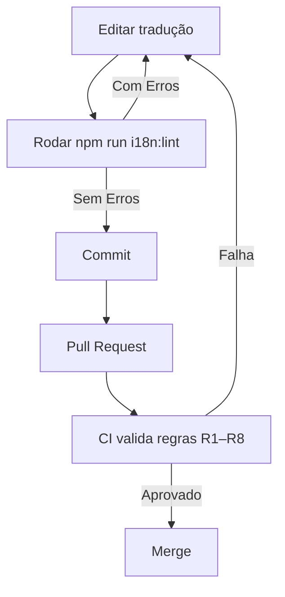

# Guia de Boas Práticas para Edição de Traduções

> Este documento define regras obrigatórias e recomendações que **toda IA ou desenvolvedor** deve seguir ao **criar, editar ou remover** chaves de tradução nos arquivos `*.json` do projeto Fixelo. O objetivo é garantir consistência, evitar regressões e manter o suporte multilíngue alinhado aos padrões da plataforma.

---

## 1. Estrutura Geral dos Arquivos

1. Todos os arquivos de mensagem residem em `apps/web/messages/<locale>.json` (`en.json`, `pt.json`, `es.json`).  
2. A estrutura de chaves **reflete diretamente** a arquitetura de páginas/ componentes.  
   Ex.: A página `/services` usa o _namespace_ `services`, portanto suas chaves vivem dentro de `"services": { ... }`.  
3. **Ordem das chaves**: mantenha a mesma ordem do arquivo original para facilitar _diffs_.
4. Identação de 2 espaços; quebras de linha LF; codificação UTF-8.

---

## 2. Regras Obrigatórias

| # | Regra | Descrição |
|---|-------|-----------|
| **R1** | **Não remover** chaves existentes | Mesmo que pareçam não utilizadas, nunca excluir sem aprovação humana explícita. |
| **R2** | **Não alterar** valores preenchidos | Só modifique se o valor estiver `""`, `"TODO"` **ou** houver instrução explícita no _prompt_. |
| **R3** | **Adicionar somente dentro do escopo correto** | Novas chaves devem ser criadas **apenas** no _namespace_ da página/componente em desenvolvimento. |
| **R4** | **Manter ordem original** | Insira novas chaves **no fim** do bloco relevante, sem reordenar pares já existentes. |
| **R5** | **Consistência de locais** | Cada chave deve existir nos **três idiomas**; se faltar em `pt.json`, adicione também em `en.json` e `es.json` com valor `"TODO"`. |
| **R6** | **Pluralização & Interpolação** | Utilize placeholders `{count}` etc. **sem** mudar os identificadores usados no código. |
| **R7** | **Sem conteúdo técnico em traduções** | Evite comentários de código, tags HTML ou Markdown dentro dos valores. |
| **R8** | **Validação Automática** | Após qualquer alteração, rode `npm run i18n:lint` e garanta zero erros/warnings. |

_Quebrar qualquer regra R1–R4 bloqueia automaticamente o _merge_ no CI._

---

## 3. Como Adicionar Novas Chaves

1. **Identifique o escopo** (namespace) exato.  
2. Abra os três arquivos de idioma.  
3. No **final** do objeto alvo, adicione:
   ```jsonc
   "novaChave": "TODO" // en.json
   "novaChave": "TODO" // es.json
   "novaChave": "<tradução PT>" // pt.json
   ```
4. Traduza `en.json` e `es.json` em seguida ou marque `TODO` para tradução posterior (mas nunca deixe vazio).
5. Execute `npm run i18n:lint`.

### Boas práticas de nomenclatura
* Use camelCase.  
* Seja descritivo, porém conciso (`cta.joinButton`).
* Evite abreviações obscuras.

---

## 4. Editar Traduções Existentes

1. Verifique se o valor atual é `""` ou `"TODO"`.  
2. Edite apenas esse campo, sem tocar nos demais.  
3. Revalide com `npm run i18n:lint`.

> **Nunca** mude o texto se já houver conteúdo, salvo instrução explícita.

---

## 5. Remover Chaves (Processo Excepcional)

1. Proibido por padrão (ver **R1**).  
2. Caso seja absolutamente necessário:
   * Abra PR separado com justificativa.  
   * Adicione migração de código que remove todas as referências.  
   * Obtenha aprovação da equipe de i18n.

---

## 6. Workflow Automatizado



---

## 7. Comandos Úteis

| Ação | Comando |
|------|---------|
| Lint/validar todos os idiomas | `npm run i18n:lint` |
| Corrigir automáticamente chaves faltantes | `npm run i18n:sync` |
| Testar página específica | `npm run dev --workspace=@fixelo/web` |

---

## 8. Exemplos de Violação

* **Remover** `"services.title"` do `pt.json` ➜ 🚫 CI falha.  
* Adicionar `"foo"` fora de qualquer namespace ➜ 🚫 bloqueado.  
* Alterar texto existente sem autorização ➜ 🚫 revertido.

---

> Siga estas diretrizes à risca para manter a qualidade, consistência e estabilidade do sistema de internacionalização do Fixelo. 